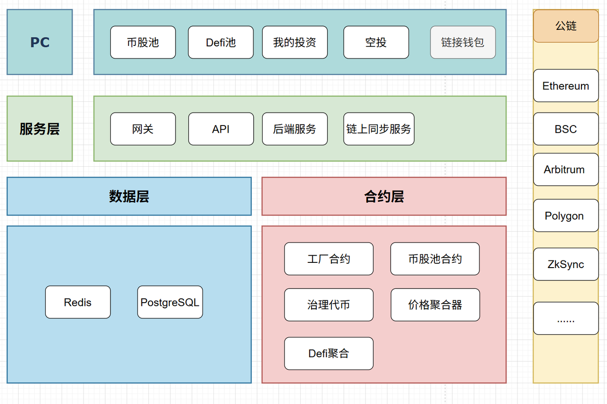
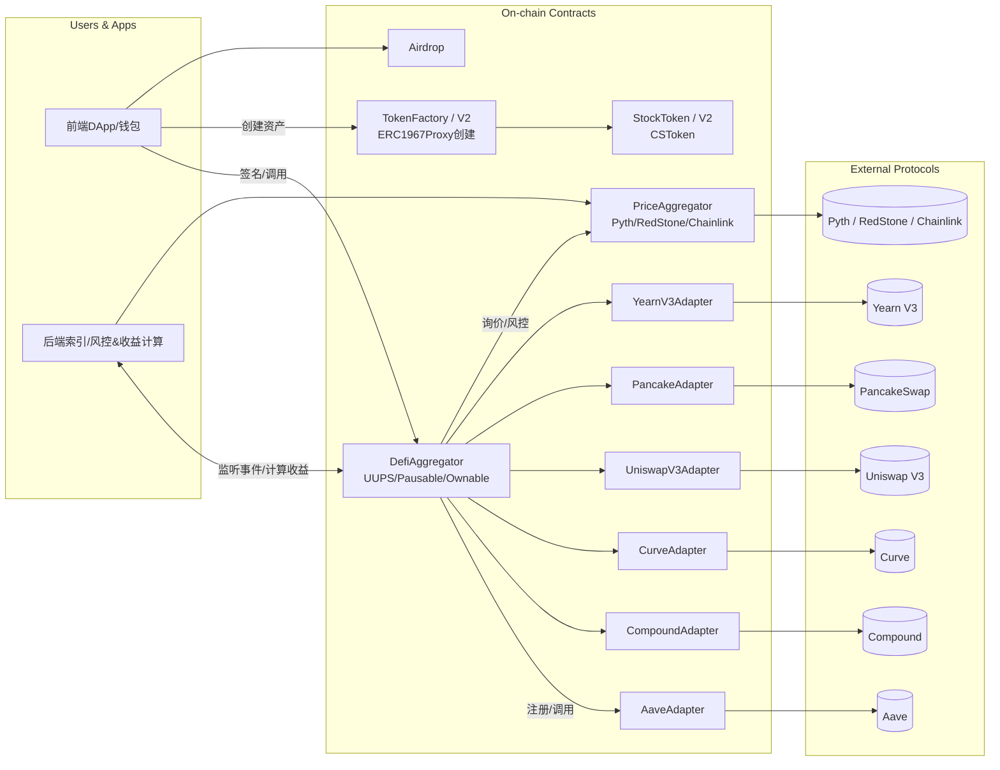
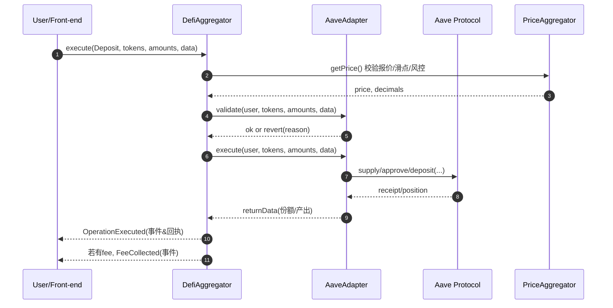
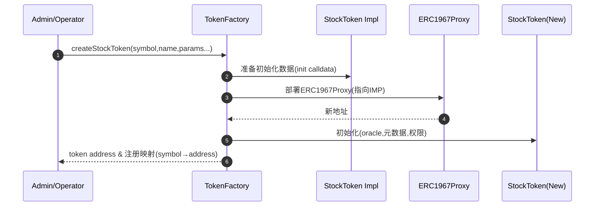

# CryptoStock 项目总体需求分析文档

> 版本: v1.0  
> 更新日期: 2025-10-13  
> 目录范围: 整个 `CryptoStock/` 根目录（含智能合约 `CryptoStockContract/`、前端 `stock-fe/`、Go 后端集群 `StockCoinEnd/`、`StockCoinBase/`、`StockCoinSync/`）

---
## 1. 项目整体概述
CryptoStock 致力于构建一个“传统股票资产代币化 + 多协议 DeFi 聚合 + 全链/链下数据同步 + 可视化交互”的一体化去中心化金融平台。平台使命：
- 将真实股票价格数据通过可信预言机引入链上，映射为可升级 ERC20 股票代币
- 为用户提供使用稳定币（USDT/USDC/DAI）进行股票代币买卖与收益策略参与能力
- 统一接入多类主流 DeFi 协议（借贷 / AMM / 流动性池 / Vault），实现收益聚合与流动性优化
- 支持链下轮询与数据服务，为前端提供实时行情、资产数据、组合统计
- 形成“多端（合约+前端+后端服务）协同 + 可扩展 + 安全可升级”的金融基础设施

### 1.1 业务愿景
| 维度 | 目标 |
| ---- | ---- |
| 资产范围 | 股票代币化（初期 6 支美股：AAPL, TSLA, GOOGL, MSFT, AMZN, NVDA），后续可扩展 ETF / 指数 / 商品 |
| 用户操作 | 链上 USDT 购买 / 卖出股票代币、参与 DeFi 收益、跨适配器策略组合 |
| 协议覆盖 | 聚合 Aave / Compound / Curve / UniswapV3 / PancakeSwap / YearnV3，未来可扩展 GMX / Pendle 等 |
| 数据保障 | 多源预言机（Pyth + RedStone），未来可扩展 Chainlink / API3，提高韧性 |
| 安全与治理 | 可升级（UUPS）、多合约隔离、事件审计、未来引入多签治理、风险监控 |
| 前端体验 | 实时价格、资产视图、交易表单、收益曲线、策略展示、钱包连接、响应式界面 |
### 1.2 业务架构图
 

### 1.3 功能流程图

#### 1.3.1 用户通过聚合器存入外部协议（以 Aave 为例）

#### 1.3.2 用工厂创建新资产（StockToken）

---
## 2. 子系统分层与职责
| 子系统 | 目录 | 主要职责 | 关键技术 |
| ------ | ---- | -------- | -------- |
| 智能合约层 | `CryptoStockContract/` | 代币化、预言机聚合、交易撮合、DeFi 适配、收益编排、安全控制 | Solidity, Hardhat, UUPS, Pyth, RedStone |
| 前端交互层 | `stock-fe/` | 用户资产与交易 UI、行情展示、钱包连接、调用合约 / 后端接口 | Next.js 15, RainbowKit, Wagmi, Ethers.js, Tailwind |
| 业务后端 API | `StockCoinEnd/` | 配置加载、HTTP API、股票数据轮询、市场数据聚合、任务调度 | Go, Gin(自定义), 定时任务, 配置热加载 |
| 基础组件库 | `StockCoinBase/` | 公共工具：链路封装、日志、重试、通用存储接口 | Go 工具包（logger/retry/stores） |
| 同步 & 命令服务 | `StockCoinSync/` | 命令行调度、同步任务执行、数据落库 | Go CLI 框架 |
| ABI / 部署产物 | `CryptoStockContract/abi/` + `deployments-*.json` | 前后端对接合约地址与接口 | 自动提取脚本 |
| 运维脚本 | `CryptoStockContract/scripts/` | 部署/升级/适配器注册/批量转账/提取 ABI | Node.js 脚本 + Hardhat |
| 测试体系 | `CryptoStockContract/test/` | 单元 / 集成 / 网络容错测试 / 适配器模拟 | Mocha, Chai, Hardhat 网络 |

---
## 3. 功能需求详述
### 3.1 股票代币化模块
| 功能 | 描述 | 关键合约 | 约束 / 校验 |
| ---- | ---- | -------- | -------- |
| 工厂创建 | 通过 `TokenFactory` 创建股票代币（一次性或批量） | `TokenFactory.sol` | 符号唯一、初始化参数合法 |
| 升级支持 | 代币与工厂采用 UUPS，可平滑升级 | `StockToken.sol` / `StockTokenV2.sol` | 升级需 owner 权限，存储布局稳定 |
| 初始供应 | 发行后分配给部署者（Owner），再用于分发/交易 | 部署脚本 | 供应量记录与事件通知 |
| 股票代币内交易 | USDT <-> 股票代币双向兑换 | `StockToken` 内部逻辑 | 价格读取成功、滑点 <= 阈值、最小交易额 >= 1 USDT |
| 手续费 | 交易按基点收取（默认 30 bps） | `StockToken` | 接收地址可更新（仅 Owner） |
| 安全控制 | 暂停 / 重入保护 / 审计事件 | `Pausable`, `ReentrancyGuard` | 暂停时禁止交互函数 |

### 3.2 价格预言机与聚合
| 功能 | 描述 | 合约 | 校验点 |
| ---- | ---- | ---- | ---- |
| 多源价格 | Pyth + RedStone 加权（60/40） | `PriceAggregator.sol` | 至少一个有效价格源成功返回 |
| 动态管理 | 添加 / 移除预言机（简化移除尾部） | `PriceAggregator` | 权重总和 > 0 |
| 资产映射 | symbol -> feedId 管理 | `PythPriceFeed.sol` / `RedstonePriceFeed.sol` | 符号非空、feedId 合法 |
| 支付更新费用 | Pyth 更新需要 payable 分发 | `PythPriceFeed` | msg.value 合理拆分 |
| 异常容错 | 单源失败跳过 | `PriceAggregator.getAggregatedPrice` | result.success == true 才纳入 |

### 3.3 DeFi 聚合与收益
| 功能 | 描述 | 合约 | 约束 |
| ---- | ---- | ---- | ---- |
| 适配器注册 | 通过名称字符串注册协议 | `DefiAggregator.sol` | 名称唯一，不可覆盖（或需先移除） |
| 协议交互 | 存款/取款/增加流动性/赎回等 | 各 `*Adapter.sol` | 目标协议地址不可为零 |
| 支持协议 | Aave / Compound / Curve / UniswapV3 / Pancake / YearnV3 | `adapters/` | 核心函数统一接口 |
| UUPS 升级 | 聚合器可迭代扩展能力 | `DefiAggregator` | 升级权限限制 |
| 费用抽象 | feeRateBps 全局管理 | `DefiAggregator` | 变更事件广播 |
| 安全 | 统一 `SafeERC20` / Pausable | 适配器 + 聚合器 | 防止重入 / 非法授权 |
| 流动性注入 | Mock 资产预置初始资金 | 部署脚本 | 确认初始化余额成功 |

### 3.4 测试与模拟
| 场景 | 说明 | Mock 支持 |
| ---- | ---- | ---- |
| 价格极值 | 0 值、暴涨、负面（跳过） | `MockPyth`, `MockRedStoneOracle` |
| 协议收益 | 动态 APY / 虚拟价格 | `MockYearnV3Vault`, `MockCurve` |
| 头寸 NFT | Uniswap V3 头寸生命周期 | `MockNonfungiblePositionManager` |
| 借贷资产 | aToken / cToken 行为 | `MockAToken`, `MockCToken` |
| 交换路径 | Pancake 双向兑换 | `MockPancakeRouter` |
| 跨网络不稳定 | Sepolia 网络重试 | 测试脚本内封装重试逻辑 |

### 3.5 前端与交互
| 功能 | 描述 | 目录 |
| ---- | ---- | ---- |
| 钱包连接 | RainbowKit + wagmi | `stock-fe/` |
| 实时价格 | 轮询 + 合约读取 + 缓存 | `hooks/`, `lib/` |
| 交易面板 | USDT 买 / 卖股票代币 | `app/` / `components/` |
| 资产展示 | 代币余额、持仓、估值 | `components/portfolio` (假设) |
| DeFi 操作 | 选择协议 + 存/取/LP | `components/defi` (假设) |
| UI 基础 | Tailwind + shadcn/ui | 全局 |
| 数据校验 | Zod + React Query | `hooks/` |

### 3.6 后端服务职责
| 服务 | 目录 | 职责 |
| ---- | ---- | ---- |
| API 网关 / 业务服务 | `StockCoinEnd/` | 配置加载、定时股票信息轮询（外部行情源）、REST API 暴露、任务调度（市值更新） |
| 公共组件库 | `StockCoinBase/` | 日志、重试、通用封装、HTTP 客户端、存储抽象 |
| 同步执行器 | `StockCoinSync/` | 命令行任务：批量同步、历史回填、数据迁移 |

---
## 4. 非功能需求
### 4.1 性能
- 股票代币买卖单次 Gas 目标：较初稿优化 ≥30%
- DeFi 复合操作通过聚合器减少多笔单独授权/调用的冗余 Gas（节省 20~30%）
- 前端请求通过 React Query/SWR 进行缓存去抖，减少 RPC 压力

### 4.2 可用性
- 核心异常（预言机失败 / 适配器未注册 / 余额不足）均有明确错误消息
- 暂停模式下用户界面应提示“只读模式”

### 4.3 可靠性
- 预言机失败自动降级（权重计算仅纳入成功返回）
- 测试网波动：引入重试机制（指数退避 <=3 次）
- 升级前后执行存储快照对比

### 4.4 安全
| 风险 | 缓解措施 |
| ---- | ---- |
| 预言机操控 | 多源加权 + 异常跳过 + 扩展更多独立数据源预留 | 
| 重入攻击 | ReentrancyGuard + Checks-Effects-Interactions 顺序 |
| 授权滥用 | 最小授权（逐次 approve，可引入 Permit 方案后续优化） |
| 升级风险 | UUPS + 仅 Owner/多签（未来） + 存储布局审计 |
| 价格过期 | publishTime 校验（可扩展 staleness 检测） |
| 滑点恶意 | 交易前计算预期价格 + 最大偏差限制 |
| 精度攻击 | 统一精度转换函数，禁止手工裸乘除 |
| 恶意适配器 | 注册白名单 + 协议地址检查 + 事件追踪 |

### 4.5 可扩展性
- 预言机层支持新增 Chainlink / API3：在 `OracleInfo` 中添加枚举即可
- 协议适配器按目录新增：实现 `IDefiAdapter`，注册即可使用
- UI 按页面/组件模块懒加载减少初始包体

### 4.6 可观测性与运维
- 部署产物：`deployments-*.json` 标准化（含 network, chainId, timestamp, proxy, implementation）
- 事件索引：未来可对接 Subgraph / 自建索引器
- 日志：合约事件 + 后端轮询日志 + 前端监控（可扩展 Sentry）

---
## 5. 角色与用例
| 角色 | 目标 | 关键用例 |
| ---- | ---- | ---- |
| 普通用户 | 参与股票代币交易与收益 | 连接钱包 → 查看价格 → 购买/出售 → 查看持仓/收益 |
| 高级用户 | 流动性与策略组合 | 选择协议 → 存入/撤出 → 跨协议调仓 |
| 运维/管理员 | 升级与参数调优 | 调整手续费、升级实现、暂停紧急处理 |
| 开发者 | 扩展协议/预言机 | 新增适配器合约、测试、部署注册 |
| 数据分析 | 观测资金/交易趋势 | 抓取事件日志、价格历史、协议收益分布 |

---
## 6. 数据模型（选摘）
| 实体 | 主要字段 | 来源 |
| ---- | ---- | ---- |
| OracleInfo | type, address, weight | `PriceAggregator` 存储 | 
| StockToken | symbol, totalSupply, feeRate, minTrade, maxSlippage | `StockToken` 状态 |
| AdapterRegistry | name -> adapterAddress | `DefiAggregator` | 
| DeploymentRecord | network, chainId, contracts, timestamp | 部署脚本 JSON |
| OperationResult | price, minPrice, maxPrice, publishTime, success, errorMessage | 预言机调用返回 |

---
## 7. 部署与环境
| 环境 | 说明 | 组件 |
| ---- | ---- | ---- |
| 本地开发 | Hardhat 本地链 + Mock 预言机 + 前端 dev | 所有子系统可并行启动 |
| 测试网 | Sepolia (chainId=11155111) | Multi-oracle + 所有适配器代理部署 |
| 生产（规划） | 主网或高性能 L2 (Arbitrum / Base) | 需增加预言机冗余与监控 |

脚本示例：
- 股票系统: `npm run deploy:stock:sepolia`
- DeFi 基础设施: `npm run deploy:infrastructure:sepolia`
- 全量适配器: `npm run deploy:all-adapters:sepolia`
- 批量转账: `npx hardhat run scripts/transfer-tokens.js --network sepolia`

---
## 8. 里程碑规划（建议）
| 阶段 | 目标 | 交付项 |
| ---- | ---- | ---- |
| M1 | 核心代币化 + 价格聚合 | 工厂 + 6 代币 + 双预言机 + 买卖测试 |
| M2 | DeFi 聚合基础 | Aggregator + Aave/Compound/Curve + 适配器事件 |
| M3 | AMM & NFT LP | UniswapV3 + Pancake + 头寸管理 UI |
| M4 | 收益策略扩展 | YearnV3 + 复合操作脚本 + 策略回测接口 |
| M5 | 安全与治理 | 多签/Timelock + 价格过期检测 + 风险仪表盘 |
| M6 | 产品增强 | 前端性能优化 + Subgraph + 资产报表导出 |

---
## 9. 风险与改进建议
| 风险 | 等级 | 建议方案 |
| ---- | ---- | ---- |
| 预言机源仍较少 | 中 | 引入第三源 + 价格中位数过滤 + 去偏算法 |
| 适配器权限集中 | 中 | 引入注册治理（多签）与可撤销机制 |
| 费用模型单一 | 低 | 扩展分层费率 / 动态 fee based on volatility |
| 没有 TWAP | 中 | 在聚合器层实现短期窗口平滑价格 |
| 事件未索引 | 中 | 建立 Subgraph 或 ETL 管道 |
| 升级流程人为依赖 | 中 | 增加脚本 + 状态快照 + 升级审计 checklist |
| Mock 与主网差距 | 低 | 加入主网 fork 测试，真实协议验证 |

---
## 10. 后续扩展路线 (Roadmap Ideas)
- 策略引擎：自动化再平衡（基于收益 / 风险系数）
- 跨链扩张：部署到 L2 (Base / Arbitrum) & 引入跨链消息桥接
- 机构级支持：添加 KYC 白名单层 & 可审计资金轨迹导出
- 可组合性：发行 ETF 风格篮子代币（多股票指数化）
- MEV 防护：考虑 Commit-Reveal / Batch Auction 市场结构
- 报警系统：价格跳变 / 适配器失败 / 交易量异常 推送

---
## 11. 结语
本文档总结了当前目录下所有核心模块的功能边界、非功能要求与未来扩展方向，可作为后续架构深化、审计、迭代与团队协作的统一蓝本。若需要进一步拆分测试用例矩阵、威胁建模（STRIDE）、数据流图或英文版需求文档，可在此基础上增量补充。

> 下一步可选产出：测试用例矩阵 / 升级流程 SOP / 安全威胁模型 / 英文版本。
