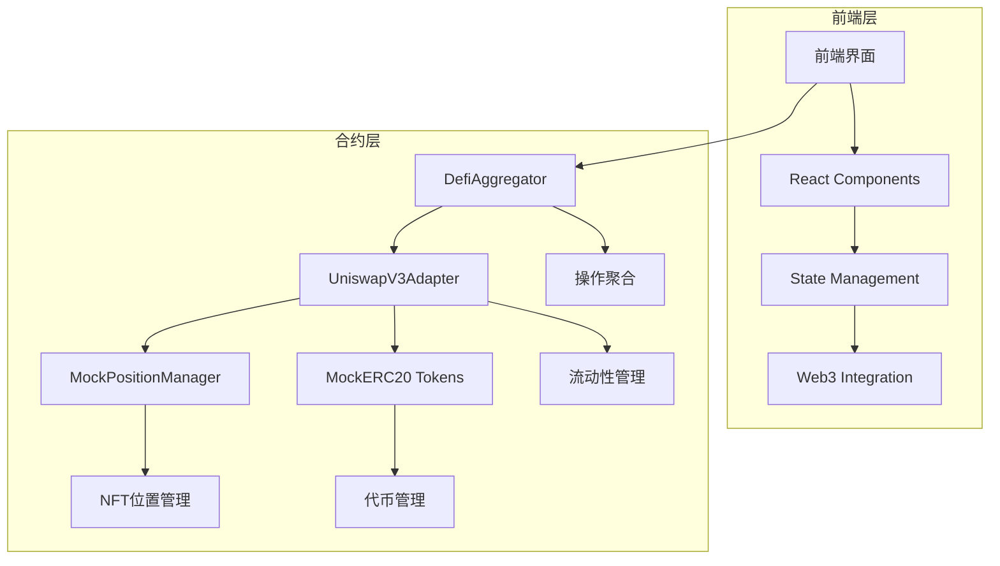

# CryptoStock Uniswap V3 文档

## 📚 文档概览

本目录包含了 CryptoStock 平台中 Uniswap V3 功能的完整技术文档，为开发团队提供详细的实现指南和API参考。

## 📋 文档结构

### 核心文档

| 文档名称 | 描述 | 目标读者 |
|---------|------|---------|
| [uniswap-v3-implementation.md](./uniswap-v3-implementation.md) | Uniswap V3 完整实现文档，包含架构设计、合约接口和部署配置 | 所有开发者 |
| [uniswap-v3-api-reference.md](./uniswap-v3-api-reference.md) | 详细的API接口文档，包含函数签名、参数说明和代码示例 | 前端/智能合约开发者 |
| [uniswap-v3-frontend-guide.md](./uniswap-v3-frontend-guide.md) | 前端集成指南，包含组件设计、状态管理和用户界面实现 | 前端开发者 |

## 🎯 快速开始

### 智能合约开发者

1. **阅读实现文档** - 了解整体架构和设计思路
2. **查看API参考** - 掌握合约接口和调用方法
3. **运行测试用例** - 验证功能完整性

```bash
# 运行本地测试
cd ../CryptoStockContract
npm run test:test/08-uniswapv3.test.js

# 运行 Sepolia 网络测试
npm run test:test/08-uniswap-sepolia.test.js --network sepolia
```

### 前端开发者

1. **阅读前端集成指南** - 了解组件架构和实现方式
2. **查看API参考** - 掌握合约交互方法
3. **参考组件示例** - 快速集成功能

```bash
# 启动前端开发服务器
cd stock-fe
npm run dev

# 构建生产版本
npm run build
```

## 🏗️ 系统架构



## 🔗 重要链接

### 合约地址 (Sepolia 测试网)

| 合约名称 | 地址 | 描述 |
|---------|------|------|
| UniswapV3Adapter | `0x0Da05F4753534669dCE540C1Bfc348f6728Bedb3` | 主适配器合约 |
| DefiAggregator | `0xD93D27d031FdF461288c904688Dd78D6902eA315` | 操作聚合器 |
| MockPositionManager | `0x8B5E5C5aA9FF2a3b17a5A9e5D6E30071Ba6BE74C` | NFT位置管理器 |
| MockERC20_USDT | `0xd7C597Cf30fb56162AEDAe8a52927B7CE4076e5B` | USDT代币 |
| MockWethToken | `0x6a1B8536678C42cacf9e2C6502bffe288c84C8bA` | WETH代币 |

### 代码仓库

- **智能合约**: `../CryptoStockContract/`
- **前端应用**: `../stock-fe/`
- **测试用例**: `../CryptoStockContract/test/`

## 🎮 核心功能

### 1. 添加流动性 (ADD_LIQUIDITY)

```javascript
const params = {
    tokens: [usdtAddress, wethAddress],
    amounts: [usdtAmount, wethAmount, usdtMin, wethMin],
    recipient: userAddress,
    deadline: timestamp,
    tokenId: 0,
    extraData: encodeAbiParameters(['int24', 'int24'], [tickLower, tickUpper])
};

const result = await defiAggregator.executeOperation("uniswapv3", 2, params);
```

### 2. 移除流动性 (REMOVE_LIQUIDITY)

```javascript
const params = {
    tokens: [usdtAddress],
    amounts: [amount0Min, amount1Min],
    recipient: userAddress,
    deadline: timestamp,
    tokenId: tokenId,
    extraData: "0x"
};

const result = await defiAggregator.executeOperation("uniswapv3", 3, params);
```

### 3. 收取手续费 (COLLECT_FEES)

```javascript
const params = {
    tokens: [usdtAddress],
    amounts: [],
    recipient: userAddress,
    deadline: timestamp,
    tokenId: tokenId,
    extraData: "0x"
};

const result = await defiAggregator.executeOperation("uniswapv3", 18, params);
```

## 🔧 开发工具

### Hardhat 命令

```bash
# 部署合约
npx hardhat run scripts/deploy-uniswapv3-adapter-only.js --network sepolia

# 运行测试
npx hardhat test test/08-uniswapv3.test.js
npx hardhat test test/08-uniswap-sepolia.test.js --network sepolia

# 验证合约
npx hardhat verify --network sepolia <CONTRACT_ADDRESS> <CONSTRUCTOR_ARGS>

# 编译合约
npx hardhat compile

# 清理缓存
npx hardhat clean
```

### 前端开发

```bash
# 安装依赖
npm install

# 开发模式
npm run dev

# 类型检查
npm run type-check

# 代码检查
npm run lint

# 构建生产版本
npm run build

# 运行测试
npm run test
```

## 🎨 UI 组件库

### 核心组件

| 组件名称 | 文件路径 | 描述 |
|---------|----------|------|
| LiquidityModal | `app/pools/uniswap/components/LiquidityModal.tsx` | 流动性操作弹窗 |
| PositionCard | `app/pools/uniswap/components/PositionCard.tsx` | 仓位展示卡片 |
| PriceRange | `app/pools/uniswap/components/PriceRange.tsx` | 价格区间选择器 |
| FeeClaim | `app/pools/uniswap/components/FeeClaim.tsx` | 手续费收取组件 |
| TokenSelector | `app/pools/uniswap/components/TokenSelector.tsx` | 代币选择器 |

### 自定义 Hooks

| Hook 名称 | 文件路径 | 描述 |
|-----------|----------|------|
| useUniswapPositions | `app/pools/uniswap/hooks/useUniswapPositions.ts` | 仓位数据管理 |
| useLiquidityOperations | `app/pools/uniswap/hooks/useLiquidityOperations.ts` | 流动性操作 |
| usePriceRange | `app/pools/uniswap/hooks/usePriceRange.ts` | 价格区间计算 |

## 📊 监控和分析

### 事件监听

```javascript
// 监听操作执行事件
uniswapAdapter.on("OperationExecuted", (user, operationType, tokens, amounts, returnData) => {
    console.log("Operation executed:", { user, operationType, tokens, amounts });
});

// 监听手续费收取事件
uniswapAdapter.on("FeesCollected", (user, tokenId, amount0, amount1) => {
    console.log("Fees collected:", { user, tokenId, amount0, amount1 });
});
```

### 性能监控

- **Gas 使用量**: 自动估算和优化
- **交易确认时间**: 实时监控网络状态
- **错误率**: 记录和分析失败交易
- **用户行为**: 追踪操作流程

## 🔒 安全考虑

### 智能合约安全

- ✅ 重入攻击防护
- ✅ 权限控制机制
- ✅ 输入验证和边界检查
- ✅ 紧急暂停功能
- ✅ 升级安全机制

### 前端安全

- ✅ 用户授权管理
- ✅ 交易前验证
- ✅ 错误处理机制
- ✅ 敏感信息保护

### 经济安全

- ✅ 滑点保护
- ✅ 手续费透明化
- ✅ 价格影响计算
- ✅ 资金安全验证

## 📈 性能优化

### 前端优化

- **代码分割**: 按路由和功能模块分割
- **懒加载**: 组件和资源按需加载
- **缓存策略**: 合理的数据缓存机制
- **Bundle 优化**: 减少打包体积

### 合约优化

- **Gas 优化**: 减少不必要的计算和存储
- **批量操作**: 支持多个操作合并执行
- **事件优化**: 高效的事件记录机制

## 🧪 测试策略

### 测试覆盖

- **单元测试**: 组件和函数级别测试
- **集成测试**: 多组件协作测试
- **端到端测试**: 完整用户流程测试
- **性能测试**: 加载和响应时间测试

### 测试工具

```bash
# 运行所有测试
npm run test

# 运行特定测试文件
npm run test -- --testPathPattern=LiquidityModal

# 运行测试并生成覆盖率报告
npm run test:coverage

# 运行 E2E 测试
npm run test:e2e
```

## 🚀 部署指南

### 环境配置

```bash
# 开发环境
cp .env.example .env.local

# 生产环境
cp .env.production .env.local
```

### 部署步骤

1. **合约部署**
   ```bash
   npx hardhat run scripts/deploy-uniswapv3-adapter-only.js --network sepolia
   ```

2. **前端构建**
   ```bash
   npm run build
   ```

3. **部署到 Vercel**
   ```bash
   vercel --prod
   ```

## 📞 技术支持

### 问题反馈

- **GitHub Issues**: 报告 Bug 和功能请求
- **开发群组**: 技术讨论和经验分享
- **文档更新**: 贡献改进建议

### 联系方式

- **技术负责人**: [联系信息]
- **开发团队**: [团队邮箱]
- **紧急联系**: [紧急联系方式]

## 📝 更新日志

### v1.0.0 (2025-10-10)

- ✅ 完成核心合约实现
- ✅ 添加完整的前端组件
- ✅ 编写详细的技术文档
- ✅ 通过 Sepolia 测试网验证
- ✅ 实现完整的测试覆盖

### 未来规划

- 🔄 支持更多代币对
- 🔄 添加高级价格策略
- 🔄 实现自动复投功能
- 🔄 优化 Gas 使用效率
- 🔄 添加收益分析工具

---

**文档维护**: CryptoStock 开发团队
**最后更新**: 2025-10-10
**版本**: v1.0.0