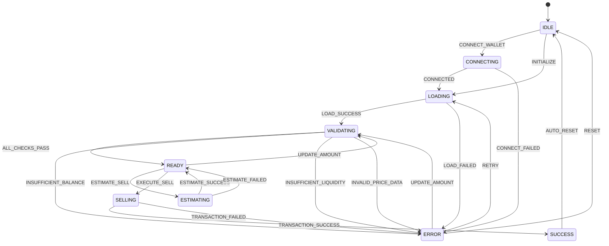
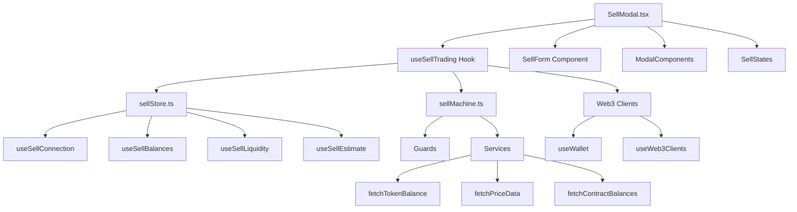

# CryptoStock 卖出功能架构设计

## 概述

本文档详细描述了CryptoStock平台股票代币卖出功能的完整架构设计，采用**XState + Zustand + React Hooks**的组合方案，基于现有的`ycdirectory-hooks`标准化状态管理模式，为复杂的卖出业务流程提供强大的状态管理能力。

### 技术栈

- **XState**: 复杂业务流程状态管理
- **Zustand**: 轻量级状态存储和跨组件共享
- **React Hooks**: 组件级逻辑封装和副作用处理
- **ycdirectory-hooks**: 标准化状态管理模板和工具
- **Viem**: 以太坊交互库
- **Tailwind CSS**: 样式框架

## 架构设计

### 分层架构模式

```
┌─────────────────────────────────────────────────────────────┐
│                    UI Components                            │
│                  (React Components)                         │
│  ┌─────────────┐  ┌─────────────┐  ┌─────────────┐         │
│  │   Amount   │  │  Slippage  │  │   Submit   │         │
│  │   Input   │  │   Control  │  │   Button  │         │
│  └─────────────┘  └─────────────┘  └─────────────┘         │
└─────────────────────────────────────────────────────────────┘
                           │
                           ▼
┌─────────────────────────────────────────────────────────────┐
│                useSellTrading Hook                          │
│  • 组件级状态管理                                         │
│  • XState 服务交互                                         │
│  • Zustand 状态订阅                                         │
│  • 前端逻辑封装                                            │
│  • 合约调用处理                                            │
│  • Web3 客户端集成                                         │
└─────────────────────────────────────────────────────────────┘
                           │
                           ▼
┌─────────────────────────────────────────────────────────────┐
│                XState Sell Machine                          │
│  • 状态转换管理                                            │
│  • 流动性验证逻辑                                          │
│  • 滑点保护机制                                            │
│  • 错误恢复策略                                            │
│  • 前置条件检查                                            │
└─────────────────────────────────────────────────────────────┘
                           │
                           ▼
┌─────────────────────────────────────────────────────────────┐
│                Zustand Sell Store                           │
│  • 代币余额存储                                            │
│  • 流动性数据管理                                          │
│  • 卖出历史记录                                            │
│  • 价格数据缓存                                            │
│  • 跨组件状态共享                                          │
└─────────────────────────────────────────────────────────────┘
                           │
                           ▼
┌─────────────────────────────────────────────────────────────┐
│                Blockchain Layer                             │
│  • StockToken 合约调用                                    │
│  • 余额查询                                                │
│  • 流动性检查                                              │
│  • 价格更新                                                │
│  • 交易确认                                                │
└─────────────────────────────────────────────────────────────┘
```

### 设计原则

1. **关注点分离**: 每一层负责特定的职责，避免混合不同类型的逻辑
2. **状态管理分层**: XState 管理流程状态，Zustand 管理数据状态
3. **类型安全**: 全面的 TypeScript 类型定义和编译时检查
4. **错误处理**: 多层错误验证和智能恢复机制
5. **可扩展性**: 模块化设计便于功能扩展和维护

## XState 状态机设计

### 状态定义

```typescript
// 卖出状态机状态定义
enum SellState {
  IDLE = 'idle',                      // 空闲状态 - 初始状态
  CONNECTING = 'connecting',          // 连接钱包 - 正在连接用户钱包
  LOADING = 'loading',                // 加载数据 - 获取余额和价格数据
  VALIDATING = 'validating',          // 验证中 - 检查交易前置条件
  READY = 'ready',                    // 准备就绪 - 所有条件满足，可以交易
  ESTIMATING = 'estimating',          // 预估计算 - 计算卖出获得的USDT数量
  SELLING = 'selling',                // 卖出中 - 正在执行区块链交易
  SUCCESS = 'success',                // 交易成功 - 交易确认完成
  ERROR = 'error'                     // 错误状态 - 任何环节出错
}
```

### 状态转换流程图



### XState 机器实现

```typescript
import { createMachine, assign } from 'xstate';
import { parseUnits, formatUnits } from 'viem';

interface SellMachineContext {
  sellAmount: string;
  slippage: number;
  tokenBalance: bigint;
  contractUsdtBalance: bigint;
  priceData: PriceData | null;
  error: string | null;
  errorCode: string | null;
  transactionHash: string | null;
}

export const sellMachine = createMachine<SellMachineContext>({
  id: 'sellMachine',
  initial: 'idle',
  context: {
    sellAmount: '',
    slippage: 3,
    tokenBalance: 0n,
    contractUsdtBalance: 0n,
    priceData: null,
    error: null,
    errorCode: null,
    transactionHash: null,
  },
  states: {
    idle: {
      on: {
        CONNECT_WALLET: 'connecting',
        INITIALIZE: 'loading'
      }
    },

    connecting: {
      invoke: {
        src: 'connectWallet',
        onDone: { target: 'loading' },
        onError: {
          target: 'error',
          actions: assign({
            error: (context, event) => event.data.message,
            errorCode: () => 'WALLET_CONNECTION_FAILED'
          })
        }
      }
    },

    loading: {
      invoke: {
        src: 'loadInitialData',
        onDone: { target: 'validating' },
        onError: {
          target: 'error',
          actions: assign({
            error: (context, event) => event.data.message,
            errorCode: () => 'DATA_LOAD_FAILED'
          })
        }
      }
    },

    validating: {
      always: [
        {
          target: 'error',
          cond: 'isTokenBalanceInsufficient',
          actions: assign({
            error: () => '代币余额不足',
            errorCode: () => 'INSUFFICIENT_BALANCE'
          })
        },
        {
          target: 'error',
          cond: 'isLiquidityInsufficient',
          actions: assign({
            error: () => '合约USDT流动性不足',
            errorCode: () => 'INSUFFICIENT_LIQUIDITY'
          })
        },
        {
          target: 'error',
          cond: 'isPriceDataInvalid',
          actions: assign({
            error: () => '价格数据无效或已过期',
            errorCode: () => 'INVALID_PRICE_DATA'
          })
        },
        { target: 'ready' }
      ]
    },

    ready: {
      on: {
        UPDATE_AMOUNT: {
          target: 'validating',
          actions: assign({
            sellAmount: (context, event) => event.amount
          })
        },
        UPDATE_SLIPPAGE: {
          actions: assign({
            slippage: (context, event) => event.slippage
          })
        },
        ESTIMATE_SELL: 'estimating',
        EXECUTE_SELL: {
          target: 'selling',
          cond: 'isSellAmountValid'
        }
      }
    },

    estimating: {
      invoke: {
        src: 'calculateEstimate',
        onDone: {
          target: 'ready'
        },
        onError: {
          target: 'ready',
          actions: assign({
            error: (context, event) => event.data.message,
            errorCode: () => 'ESTIMATE_FAILED'
          })
        }
      }
    },

    selling: {
      invoke: {
        src: 'executeSell',
        onDone: {
          target: 'success',
          actions: assign({
            transactionHash: (context, event) => event.data.hash
          })
        },
        onError: {
          target: 'error',
          actions: assign({
            error: (context, event) => event.data.message,
            errorCode: () => 'TRANSACTION_FAILED'
          })
        }
      }
    },

    success: {
      after: {
        3000: 'idle'  // 3秒后自动返回空闲状态
      }
    },

    error: {
      on: {
        RETRY: 'loading',
        UPDATE_AMOUNT: {
          target: 'validating',
          actions: assign({
            sellAmount: (context, event) => event.amount
          })
        },
        RESET: {
          target: 'idle',
          actions: assign({
            error: null,
            errorCode: null,
            transactionHash: null
          })
        }
      }
    }
  }
});
```

### Guards (条件检查)

```typescript
const guards = {
  // 代币余额检查
  isTokenBalanceInsufficient: (context) => {
    if (!context.sellAmount || !context.tokenBalance) return false;
    const sellAmountWei = parseUnits(context.sellAmount, 18);
    return context.tokenBalance < sellAmountWei;
  },

  // 流动性检查
  isLiquidityInsufficient: (context) => {
    if (!context.priceData) return false;
    const sellAmount = parseFloat(context.sellAmount);
    const pricePerToken = parseFloat(context.priceData.price);
    const estimatedUsdt = sellAmount * pricePerToken;
    const estimatedUsdtWei = BigInt(Math.floor(estimatedUsdt * 1e6));
    return context.contractUsdtBalance < estimatedUsdtWei;
  },

  // 价格数据有效性检查
  isPriceDataInvalid: (context) => {
    if (!context.priceData) return true;
    const now = Date.now();
    const priceAge = now - context.priceData.publish_time;
    return priceAge > 300000; // 5分钟过期
  },

  // 卖出数量有效性检查
  isSellAmountValid: (context) => {
    const sellAmount = parseFloat(context.sellAmount);
    return sellAmount > 0 &&
           sellAmount <= parseFloat(formatUnits(context.tokenBalance, 18));
  }
};
```

### 服务实现 (Services)

```typescript
const services = {
  // 连接钱包服务
  connectWallet: async (context) => {
    const { address, isConnected } = useWallet();
    if (!isConnected) {
      throw new Error('钱包连接失败');
    }
    return { address };
  },

  // 加载初始数据服务
  loadInitialData: async (context) => {
    const { publicClient, address } = useWeb3Clients();

    // 并行加载余额和价格数据
    const [tokenBalance, contractBalances, priceData] = await Promise.all([
      fetchTokenBalance(address),
      fetchContractBalances(),
      fetchPriceData()
    ]);

    return {
      tokenBalance,
      contractUsdtBalance: contractBalances.usdt,
      priceData
    };
  },

  // 计算预估服务
  calculateEstimate: async (context) => {
    const { sellAmount, slippage, priceData } = context;

    if (!sellAmount || !priceData) {
      throw new Error('缺少必要参数进行预估计算');
    }

    const sellAmountWei = parseUnits(sellAmount, 18);
    const pricePerToken = parseFloat(priceData.price);
    const usdtAmount = parseFloat(sellAmount) * pricePerToken;

    const estimatedUsdt = BigInt(Math.floor(usdtAmount * 1e6));
    const slippagePercentage = BigInt(100 - slippage);
    const minUsdtAmount = (estimatedUsdt * slippagePercentage) / 100n;

    // 调用合约获取更精确的预估
    const [actualEstimated, fee] = await contract.getSellEstimate(sellAmountWei);

    return {
      estimatedUsdt: actualEstimated,
      minUsdtAmount,
      estimatedFee: fee
    };
  },

  // 执行卖出服务
  executeSell: async (context) => {
    const { sellAmount, slippage } = context;
    const { walletClient, publicClient } = useWeb3Clients();

    const sellAmountWei = parseUnits(sellAmount, 18);
    const estimate = await services.calculateEstimate(context);
    const minUsdtAmount = estimate.minUsdtAmount;

    const txHash = await stockTokenContract.sell(
      sellAmountWei,
      minUsdtAmount,
      [], // updateData
      { value: 0n } // no value for sell
    );

    // 等待交易确认
    const receipt = await publicClient.waitForTransactionReceipt({ hash: txHash });

    if (receipt.status !== 'success') {
      throw new Error('交易失败');
    }

    return { hash: txHash, receipt };
  }
};
```

## Zustand Store 设计

### Store 接口定义

```typescript
import { create } from 'zustand';
import { devtools, subscribeWithSelector } from 'zustand/middleware';
import { Address, bigint, formatUnits, parseUnits } from 'viem';

export interface TokenInfo {
  symbol: string;
  name: string;
  address: Address;
  price: number;
  change24h: number;
  volume24h: number;
  marketCap: number;
}

export interface LiquidityInfo {
  contractUsdtBalance: bigint;
  maxSellableTokens: bigint;
  isSufficient: boolean;
  shortageAmount: bigint;
  lastChecked: number;
}

export interface TransactionRecord {
  hash: string;
  tokenAmount: bigint;
  usdtAmount: bigint;
  feeAmount: bigint;
  timestamp: number;
  status: 'pending' | 'success' | 'failed';
}

export interface Estimate {
  estimatedUsdt: bigint;
  minUsdtAmount: bigint;
  estimatedFee: bigint;
  timestamp: number;
}

export interface PriceData {
  price: string;
  conf: string;
  expo: number;
  publish_time: number;
  formatted: {
    price: string;
    conf: string;
    confidence: string;
  };
  source: string;
}

/**
 * 卖出 Store 状态接口
 */
export interface SellStore {
  // ===== 连接状态 =====
  isConnected: boolean;
  address: Address | null;

  // ===== 代币信息 =====
  token: TokenInfo | null;

  // ===== 余额信息 =====
  tokenBalance: bigint;
  contractTokenBalance: bigint;
  contractUsdtBalance: bigint;
  lastBalanceUpdate: number;

  // ===== 流动性信息 =====
  liquidityInfo: LiquidityInfo | null;

  // ===== 卖出参数 =====
  sellAmount: string;
  slippage: number;
  customSlippage: string;

  // ===== 预估结果 =====
  estimate: Estimate | null;

  // ===== 价格数据 =====
  priceData: PriceData | null;

  // ===== 交易状态 =====
  transactionHash: Address | null;
  isTransactionPending: boolean;
  currentTransaction: TransactionRecord | null;

  // ===== 错误信息 =====
  error: string | null;
  errorCode: string | null;

  // ===== 历史记录 =====
  sellHistory: TransactionRecord[];

  // ===== 缓存管理 =====
  maxSellableTokens: bigint;
  lastCacheClear: number;

  // ===== 方法集合 =====
  // 连接管理
  setConnected: (connected: boolean, address?: Address) => void;

  // 代币管理
  setToken: (token: TokenInfo) => void;

  // 余额管理
  setTokenBalance: (balance: bigint) => void;
  setContractBalances: (tokenBalance: bigint, usdtBalance: bigint) => void;
  updateAllBalances: () => Promise<void>;

  // 卖出参数
  setSellAmount: (amount: string) => void;
  setSlippage: (slippage: number, customSlippage?: string) => void;

  // 预估计算
  setEstimate: (estimate: Estimate) => void;
  calculateEstimate: () => Promise<void>;
  clearEstimate: () => void;

  // 价格数据
  setPriceData: (priceData: PriceData) => void;
  updatePriceData: () => Promise<void>;
  isPriceDataValid: () => boolean;

  // 流动性检查
  updateLiquidityInfo: () => Promise<LiquidityInfo>;
  checkLiquidity: (requiredUsdt: bigint) => LiquidityInfo;

  // 交易管理
  setTransactionPending: (pending: boolean, hash?: Address) => void;
  addTransaction: (transaction: TransactionRecord) => void;
  clearTransaction: () => void;

  // 错误管理
  setError: (error: string, errorCode?: string) => void;
  clearError: () => void;

  // 重置方法
  reset: () => void;
}
```

### Store 实现

```typescript
/**
 * 卖出 Store 实现
 */
export const useSellStore = create<SellStore>()(
  devtools(
    subscribeWithSelector((set, get) => ({
      // ==================== 初始状态 ====================
      isConnected: false,
      address: null,

      token: null,

      tokenBalance: BigInt(0),
      contractTokenBalance: BigInt(0),
      contractUsdtBalance: BigInt(0),
      lastBalanceUpdate: 0,

      liquidityInfo: null,

      sellAmount: '',
      slippage: 3,
      customSlippage: '',

      estimate: null,

      priceData: null,

      transactionHash: null,
      isTransactionPending: false,
      currentTransaction: null,

      error: null,
      errorCode: null,

      sellHistory: [],

      maxSellableTokens: BigInt(0),
      lastCacheClear: Date.now(),

      // ==================== 方法实现 ====================
      setConnected: (connected: boolean, address?: Address) => {
        console.log('🔗 设置连接状态:', { connected, address });
        set({ isConnected: connected, address: address || null });
      },

      setToken: (token: TokenInfo) => {
        console.log('🪙 设置代币信息:', token);
        set({ token });
      },

      setTokenBalance: (balance: bigint) => {
        console.log('💰 设置代币余额:', balance.toString());
        set((state) => ({
          tokenBalance: balance,
          lastBalanceUpdate: Date.now(),
        }));

        // 自动重新计算最大可卖出数量
        const currentState = get();
        if (currentState.liquidityInfo) {
          const maxTokens = currentState.liquidityInfo.contractUsdtBalance > 0n
            ? (currentState.liquidityInfo.contractUsdtBalance * BigInt(1e18)) /
              BigInt(parseFloat(currentState.priceData?.price || "100") * 1e6)
            : 0n;

          set({ maxSellableTokens: maxTokens });
        }
      },

      setContractBalances: (tokenBalance: bigint, usdtBalance: bigint) => {
        console.log('🏦 设置合约余额:', {
          tokenBalance: tokenBalance.toString(),
          usdtBalance: usdtBalance.toString(),
        });
        set({
          contractTokenBalance: tokenBalance,
          contractUsdtBalance: usdtBalance,
        });
      },

      updateAllBalances: async () => {
        // 在 hook 中实现具体的合约调用逻辑
        console.log('🔄 更新所有余额');
      },

      setSellAmount: (amount: string) => {
        console.log('📝 设置卖出数量:', amount);
        set({ sellAmount: amount });
      },

      setSlippage: (slippage: number, customSlippage = '') => {
        console.log('📊 设置滑点:', { slippage, customSlippage });
        set({ slippage, customSlippage });
      },

      setEstimate: (estimate: Estimate) => {
        console.log('📈 设置预估结果:', estimate);
        set({ estimate });
      },

      calculateEstimate: async () => {
        const state = get();
        if (!state.sellAmount || !state.priceData || !state.token) {
          console.warn('⚠️ 缺少必要参数进行预估计算');
          return;
        }

        try {
          console.log('🧮 开始计算预估...');

          const sellAmountWei = parseUnits(state.sellAmount, 18);
          const pricePerToken = parseFloat(state.priceData.price);
          const usdtAmount = parseFloat(state.sellAmount) * pricePerToken;

          const estimatedUsdt = BigInt(Math.floor(usdtAmount * 1e6));
          const slippagePercentage = BigInt(100 - state.slippage);
          const minUsdtAmount = (estimatedUsdt * slippagePercentage) / 100n;

          // 简化的手续费计算 (0.3%)
          const estimatedFee = estimatedUsdt * BigInt(30) / 10000n;

          const estimate: Estimate = {
            estimatedUsdt,
            minUsdtAmount,
            estimatedFee,
            timestamp: Date.now(),
          };

          get().setEstimate(estimate);
          console.log('✅ 预估计算完成:', {
            estimatedUsdt: formatUnits(estimatedUsdt, 6),
            minUsdtAmount: formatUnits(minUsdtAmount, 6),
            estimatedFee: formatUnits(estimatedFee, 6),
          });
        } catch (error) {
          console.error('❌ 预估计算失败:', error);
          get().setError('预估计算失败', 'ESTIMATE_FAILED');
        }
      },

      clearEstimate: () => {
        console.log('🧹 清除预估结果');
        set({ estimate: null });
      },

      setPriceData: (priceData: PriceData) => {
        console.log('💹 设置价格数据:', priceData);
        set({ priceData });
      },

      updatePriceData: async () => {
        // 在 hook 中实现具体的合约调用逻辑
        console.log('🔄 更新价格数据');
      },

      isPriceDataValid: () => {
        const state = get();
        if (!state.priceData) return false;

        const now = Date.now();
        const priceAge = now - state.priceData.publish_time;
        return priceAge <= 300000; // 5分钟有效期
      },

      updateLiquidityInfo: async () => {
        const state = get();
        if (!state.isConnected) {
          throw new Error('钱包未连接');
        }

        const contractUsdtBalance = state.contractUsdtBalance;
        const currentPrice = parseFloat(state.priceData?.price || "100");

        // 计算最大可卖出代币数量
        const maxSellableTokens = contractUsdtBalance > 0n
          ? (contractUsdtBalance * BigInt(1e18)) / BigInt(currentPrice * 1e6)
          : 0n;

        const isSufficient = contractUsdtBalance >= parseUnits("100", 6);
        const shortageAmount = isSufficient ? 0n : parseUnits("100", 6) - contractUsdtBalance;

        const liquidityInfo: LiquidityInfo = {
          contractUsdtBalance,
          maxSellableTokens,
          isSufficient,
          shortageAmount,
          lastChecked: Date.now(),
        };

        set({
          liquidityInfo,
          maxSellableTokens,
        });

        console.log('💧 流动性信息更新:', {
          contractUsdtBalance: formatUnits(contractUsdtBalance, 6),
          maxSellableTokens: formatUnits(maxSellableTokens, 18),
          isSufficient,
          shortageAmount: formatUnits(shortageAmount, 6),
        });

        return liquidityInfo;
      },

      checkLiquidity: (requiredUsdt: bigint) => {
        const state = get();
        const contractUsdtBalance = state.contractUsdtBalance;

        const shortageAmount = contractUsdtBalance < requiredUsdt
          ? requiredUsdt - contractUsdtBalance
          : 0n;

        const liquidityInfo: LiquidityInfo = {
          contractUsdtBalance,
          maxSellableTokens: state.maxSellableTokens,
          isSufficient: contractUsdtBalance >= requiredUsdt,
          shortageAmount,
          lastChecked: Date.now(),
        };

        console.log('💧 检查流动性:', {
          required: formatUnits(requiredUsdt, 6),
          available: formatUnits(contractUsdtBalance, 6),
          shortage: formatUnits(shortageAmount, 6),
          isSufficient: liquidityInfo.isSufficient,
        });

        return liquidityInfo;
      },

      setTransactionPending: (pending: boolean, hash?: Address) => {
        console.log('⏳ 设置交易状态:', { pending, hash });
        set({
          isTransactionPending: pending,
          transactionHash: hash || null,
        });
      },

      addTransaction: (transaction: TransactionRecord) => {
        console.log('📝 添加交易记录:', transaction.hash);
        set((state) => ({
          sellHistory: [transaction, ...state.sellHistory],
          currentTransaction: transaction,
        }));
      },

      clearTransaction: () => {
        console.log('🧹 清除当前交易');
        set({
          currentTransaction: null,
          transactionHash: null,
          isTransactionPending: false,
        });
      },

      setError: (error: string, errorCode?: string) => {
        console.error('❌ 设置错误:', { error, errorCode });
        set({
          error,
          errorCode: errorCode || null,
        });
      },

      clearError: () => {
        console.log('🧹 清除错误信息');
        set({
          error: null,
          errorCode: null,
        });
      },

      reset: () => {
        console.log('🔄 重置卖出 Store');
        set({
          isConnected: false,
          address: null,
          token: null,
          tokenBalance: BigInt(0),
          contractTokenBalance: BigInt(0),
          contractUsdtBalance: BigInt(0),
          lastBalanceUpdate: 0,
          liquidityInfo: null,
          sellAmount: '',
          slippage: 3,
          customSlippage: '',
          estimate: null,
          priceData: null,
          transactionHash: null,
          isTransactionPending: false,
          currentTransaction: null,
          error: null,
          errorCode: null,
          sellHistory: [],
          maxSellableTokens: BigInt(0),
          lastCacheClear: Date.now(),
        });
      },
    })),
    {
      name: 'sell-store',
      enabled: process.env.NODE_ENV === 'development',
    }
  )
);
```

### 选择器 Hooks

```typescript
/**
 * 获取连接状态
 */
export const useSellConnection = () => {
  return useSellStore((state) => ({
    isConnected: state.isConnected,
    address: state.address,
  }));
};

/**
 * 获取代币信息
 */
export const useSellToken = () => {
  return useSellStore((state) => state.token);
};

/**
 * 获取余额信息
 */
export const useSellBalances = () => {
  return useSellStore((state) => ({
    tokenBalance: state.tokenBalance,
    contractTokenBalance: state.contractTokenBalance,
    contractUsdtBalance: state.contractUsdtBalance,
    maxSellableTokens: state.maxSellableTokens,
    lastBalanceUpdate: state.lastBalanceUpdate,
  }));
};

/**
 * 获取流动性信息
 */
export const useSellLiquidity = () => {
  return useSellStore((state) => state.liquidityInfo);
};

/**
 * 获取卖出参数
 */
export const useSellParams = () => {
  return useSellStore((state) => ({
    sellAmount: state.sellAmount,
    slippage: state.slippage,
    customSlippage: state.customSlippage,
  }));
};

/**
 * 获取预估结果
 */
export const useSellEstimate = () => {
  return useSellStore((state) => {
    if (!state.estimate) return null;

    return {
      ...state.estimate,
      formattedEstimatedUsdt: formatUnits(state.estimate.estimatedUsdt, 6),
      formattedMinUsdtAmount: formatUnits(state.estimate.minUsdtAmount, 6),
      formattedEstimatedFee: formatUnits(state.estimate.estimatedFee, 6),
    };
  });
};

/**
 * 获取交易状态
 */
export const useSellTransaction = () => {
  return useSellStore((state) => ({
    transactionHash: state.transactionHash,
    isTransactionPending: state.isTransactionPending,
    currentTransaction: state.currentTransaction,
    sellHistory: state.sellHistory,
  }));
};

/**
 * 获取错误状态
 */
export const useSellError = () => {
  return useSellStore((state) => ({
    error: state.error,
    errorCode: state.errorCode,
  }));
};

/**
 * 获取操作方法
 */
export const useSellActions = () => {
  return useSellStore((state) => ({
    setConnected: state.setConnected,
    setToken: state.setToken,
    setTokenBalance: state.setTokenBalance,
    setContractBalances: state.setContractBalances,
    updateAllBalances: state.updateAllBalances,
    setSellAmount: state.setSellAmount,
    setSlippage: state.setSlippage,
    setEstimate: state.setEstimate,
    calculateEstimate: state.calculateEstimate,
    clearEstimate: state.clearEstimate,
    setPriceData: state.setPriceData,
    updatePriceData: state.updatePriceData,
    isPriceDataValid: state.isPriceDataValid,
    updateLiquidityInfo: state.updateLiquidityInfo,
    checkLiquidity: state.checkLiquidity,
    setTransactionPending: state.setTransactionPending,
    addTransaction: state.addTransaction,
    clearTransaction: state.clearTransaction,
    setError: state.setError,
    clearError: state.clearError,
    reset: state.reset,
  }));
};
```

## React Hook 封装层

### 主 Hook 接口

```typescript
import { useInterpret } from '@xstate/react';
import { sellMachine } from '../machines/sellMachine';
import { useSellStore, useSellActions } from '../stores/sellStore';
import { useWallet } from 'yc-sdk-ui';
import { useWeb3Clients } from 'yc-sdk-ui';

interface UseSellTradingProps {
  token: TokenInfo;
  usdtAddress: Address;
  oracleAddress: Address;
  stockTokenAddress: Address;
  onTransactionComplete?: (result: TransactionResult) => void;
  onError?: (error: string) => void;
}

interface UseSellTradingReturn {
  // 状态信息
  currentSellState: string;
  isConnected: boolean;
  isLoading: boolean;
  canSell: boolean;

  // 数据信息
  tokenInfo: TokenInfo | null;
  balances: BalanceInfo;
  liquidity: LiquidityInfo;
  estimate: EstimateInfo | null;

  // 操作方法
  setSellAmount: (amount: string) => void;
  setSlippage: (slippage: number, customSlippage?: string) => void;
  handleSell: () => Promise<TransactionResult>;
  retry: () => void;
  reset: () => void;

  // 状态查询
  isState: (state: string) => boolean;
  canProceed: () => boolean;
  getProgress: () => number;
  getSellMaxAmount: () => string;
  hasSufficientBalance: (amount: string) => boolean;

  // 错误处理
  error: string | null;
  clearError: () => void;

  // 实时数据
  refreshData: () => Promise<void>;
  refreshBalances: () => Promise<void>;
  refreshPrice: () => Promise<void>;
}

interface TransactionResult {
  success: boolean;
  hash?: Address;
  data?: {
    tokenAmount: string;
    usdtAmount: string;
    feeAmount: string;
  };
  error?: string;
}

interface BalanceInfo {
  tokenBalance: bigint;
  formattedTokenBalance: string;
  maxSellable: bigint;
  formattedMaxSellable: string;
}

interface EstimateInfo {
  estimatedUsdt: bigint;
  formattedEstimatedUsdt: string;
  minUsdtAmount: bigint;
  formattedMinUsdtAmount: string;
  estimatedFee: bigint;
  formattedEstimatedFee: string;
}
```

### Hook 实现

```typescript
/**
 * 卖出交易 Hook
 */
export const useSellTrading = ({
  token,
  usdtAddress,
  oracleAddress,
  stockTokenAddress,
  onTransactionComplete,
  onError
}: UseSellTradingProps): UseSellTradingReturn => {
  // XState 状态机服务
  const [state, send] = useInterpret(sellMachine);

  // Zustand Store
  const sellStore = useSellStore();
  const actions = useSellActions();

  // Web3 客户端
  const { publicClient, walletClient, getWalletClient } = useWeb3Clients();
  const { isConnected, address } = useWallet();

  // 初始化
  useEffect(() => {
    if (token && isConnected) {
      actions.setToken(token);
      actions.setConnected(true, address);
      send({ type: 'INITIALIZE' });
    }
  }, [token, isConnected, address]);

  // 卖出金额设置
  const setSellAmount = useCallback((amount: string) => {
    actions.setSellAmount(amount);
    send({ type: 'UPDATE_AMOUNT', amount });
  }, [send, actions]);

  // 滑点设置
  const setSlippage = useCallback((slippage: number, customSlippage = '') => {
    actions.setSlippage(slippage, customSlippage);
    send({ type: 'UPDATE_SLIPPAGE', slippage });

    // 滑点变化时重新计算预估
    if (sellStore.estimate) {
      actions.calculateEstimate();
    }
  }, [send, actions, sellStore.estimate]);

  // 卖出执行
  const handleSell = useCallback(async (): Promise<TransactionResult> => {
    try {
      send({ type: 'EXECUTE_SELL' });

      const sellAmountWei = parseUnits(sellStore.sellAmount, 18);
      const minUsdtAmount = sellStore.estimate?.minUsdtAmount || 0n;

      actions.setTransactionPending(true);

      const txHash = await stockTokenContract.sell(
        sellAmountWei,
        minUsdtAmount,
        [], // updateData
        { value: 0n } // no value for sell
      );

      const receipt = await publicClient.waitForTransactionReceipt({
        hash: txHash
      });

      if (receipt.status === 'success') {
        await refreshBalances();

        actions.addTransaction({
          hash: txHash,
          tokenAmount: sellAmountWei,
          usdtAmount: sellStore.estimate?.estimatedUsdt || 0n,
          feeAmount: sellStore.estimate?.estimatedFee || 0n,
          timestamp: Date.now(),
          status: 'success'
        });

        send({ type: 'TRANSACTION_SUCCESS', hash: txHash });

        const result = {
          success: true,
          hash: txHash,
          data: {
            tokenAmount: sellStore.sellAmount,
            usdtAmount: formatUnits(sellStore.estimate.estimatedUsdt, 6),
            feeAmount: formatEther(sellStore.estimate.estimatedFee)
          }
        };

        onTransactionComplete?.(result);
        return result;
      } else {
        throw new Error('交易失败');
      }
    } catch (error) {
      send({ type: 'TRANSACTION_ERROR', error: error.message });
      onError?.(error.message);

      return {
        success: false,
        error: error.message
      };
    } finally {
      actions.setTransactionPending(false);
    }
  }, [
    send,
    sellStore,
    actions,
    publicClient,
    onTransactionComplete,
    onError
  ]);

  // 工具方法
  const refreshBalances = useCallback(async () => {
    if (!address || !publicClient) return;

    try {
      const [tokenBalance, contractBalances] = await Promise.all([
        fetchTokenBalance(address, sellStore.token?.address),
        fetchContractBalances()
      ]);

      actions.setTokenBalance(tokenBalance);
      actions.setContractBalances(contractBalances.token, contractBalances.usdt);
    } catch (error) {
      console.error('刷新余额失败:', error);
    }
  }, [address, publicClient, actions, sellStore.token?.address]);

  const refreshPrice = useCallback(async () => {
    if (!sellStore.token) return;

    try {
      const priceData = await fetchPriceData(sellStore.token.symbol);
      actions.setPriceData(priceData);
    } catch (error) {
      console.error('刷新价格失败:', error);
    }
  }, [actions, sellStore.token]);

  const refreshData = useCallback(async () => {
    await Promise.all([
      refreshBalances(),
      refreshPrice()
    ]);
  }, [refreshBalances, refreshPrice]);

  const getProgress = useCallback(() => {
    const stateProgress: Record<string, number> = {
      idle: 0,
      connecting: 10,
      loading: 30,
      validating: 50,
      ready: 100,
      estimating: 70,
      selling: 90,
      success: 100,
      error: 0
    };
    return stateProgress[state.value] || 0;
  }, [state.value]);

  return {
    currentSellState: state.value,
    isConnected,
    isLoading: state.matches('loading') || state.matches('validating') || state.matches('estimating'),
    canSell: state.matches('ready'),
    tokenInfo: sellStore.token,
    balances: {
      tokenBalance: sellStore.tokenBalance,
      formattedTokenBalance: formatUnits(sellStore.tokenBalance, 18),
      maxSellable: sellStore.maxSellableTokens,
      formattedMaxSellable: formatUnits(sellStore.maxSellableTokens, 18),
    },
    liquidity: sellStore.liquidityInfo,
    estimate: sellStore.estimate ? {
      ...sellStore.estimate,
      formattedEstimatedUsdt: formatUnits(sellStore.estimate.estimatedUsdt, 6),
      formattedMinUsdtAmount: formatUnits(sellStore.estimate.minUsdtAmount, 6),
      formattedEstimatedFee: formatUnits(sellStore.estimate.estimatedFee, 6),
    } : null,
    setSellAmount,
    setSlippage,
    handleSell,
    retry: () => send({ type: 'RETRY' }),
    reset: () => send({ type: 'RESET' }),
    isState: (stateName) => state.matches(stateName),
    canProceed: () => state.matches('ready'),
    getProgress,
    getSellMaxAmount: () => formatUnits(sellStore.maxSellableTokens, 18),
    hasSufficientBalance: (amount) => {
      const amountWei = parseUnits(amount, 18);
      return sellStore.tokenBalance >= amountWei;
    },
    error: sellStore.error,
    clearError: actions.clearError,
    refreshData,
    refreshBalances,
    refreshPrice,
  };
};
```

## 组件集成方案

### 主组件结构

```typescript
import React from 'react';
import { useSellTrading } from '../hooks/useSellTrading';
import { useToast } from '@/hooks/use-toast';

interface SellModalProps {
  token: TokenInfo;
  onClose: () => void;
  usdtAddress: Address;
  oracleAddress: Address;
  stockTokenAddress: Address;
}

export default function SellModal({
  token,
  onClose,
  usdtAddress,
  oracleAddress,
  stockTokenAddress
}: SellModalProps) {
  const { toast } = useToast();

  const {
    currentSellState,
    isConnected,
    canSell,
    isLoading,
    tokenInfo,
    balances,
    liquidity,
    estimate,
    setSellAmount,
    setSlippage,
    handleSell,
    retry,
    error,
    clearError,
    isState,
    canProceed
  } = useSellTrading({
    token,
    usdtAddress,
    oracleAddress,
    stockTokenAddress,
    onError: (error) => toast.error({
      title: "错误",
      description: error
    }),
    onTransactionComplete: (result) => {
      if (result.success) {
        toast.success({
          title: "卖出成功",
          description: `获得 ${result.data?.usdtAmount} USDT`
        });
        onClose();
      }
    }
  });

  // 状态渲染逻辑
  const renderContent = () => {
    switch (currentSellState) {
      case 'connecting':
        return <ConnectingWallet />;
      case 'loading':
        return <LoadingData />;
      case 'validating':
        return <ValidatingSale />;
      case 'estimating':
        return <CalculatingEstimate />;
      case 'selling':
        return <SellingProcess />;
      case 'success':
        return <TransactionSuccess onClose={onClose} />;
      case 'error':
        return <TransactionError
          error={error}
          onRetry={retry}
          onClose={onClose}
        />;
      default:
        return (
          <SellForm
            tokenInfo={tokenInfo}
            balances={balances}
            liquidity={liquidity}
            estimate={estimate}
            onAmountChange={setSellAmount}
            onSlippageChange={setSlippage}
            onSell={handleSell}
            canSell={canSell}
          />
        );
    }
  };

  return (
    <Modal isOpen={true} onClose={onClose}>
      <ModalHeader token={tokenInfo} action="卖出" />
      <ModalContent>
        {renderContent()}
      </ModalContent>
      <ModalFooter
        onClose={onClose}
        disabled={isState('selling')}
      />
    </Modal>
  );
}
```

### 状态组件设计

```typescript
// 连接钱包组件
export const ConnectingWallet = () => (
  <div className="flex items-center justify-center py-8">
    <Loader2 className="w-6 h-6 animate-spin mr-2" />
    <span>连接钱包中...</span>
  </div>
);

// 加载数据组件
export const LoadingData = () => (
  <div className="flex items-center justify-center py-8">
    <Loader2 className="w-6 h-6 animate-spin mr-2" />
    <span>加载数据中...</span>
  </div>
);

// 验证组件
export const ValidatingSale = () => (
  <div className="flex items-center justify-center py-8">
    <Loader2 className="w-6 h-6 animate-spin mr-2" />
    <span>验证交易条件...</span>
  </div>
);

// 计算预估组件
export const CalculatingEstimate = () => (
  <div className="flex items-center justify-center py-8">
    <Loader2 className="w-6 h-6 animate-spin mr-2" />
    <span>计算预估金额...</span>
  </div>
);

// 卖出处理组件
export const SellingProcess = () => (
  <div className="flex items-center justify-center py-8">
    <Loader2 className="w-6 h-6 animate-spin mr-2" />
    <span>执行卖出交易...</span>
  </div>
);

// 交易成功组件
export const TransactionSuccess = ({ onClose }: { onClose: () => void }) => (
  <div className="text-center py-8">
    <CheckCircle className="w-12 h-12 text-green-500 mx-auto mb-4" />
    <h3 className="text-lg font-semibold mb-2">交易成功</h3>
    <button onClick={onClose} className="btn-primary">
      完成
    </button>
  </div>
);

// 交易错误组件
export const TransactionError = ({
  error,
  onRetry,
  onClose
}: {
  error: string | null;
  onRetry: () => void;
  onClose: () => void;
}) => (
  <div className="text-center py-8">
    <AlertCircle className="w-12 h-12 text-red-500 mx-auto mb-4" />
    <h3 className="text-lg font-semibold mb-2">交易失败</h3>
    <p className="text-gray-600 mb-4">{error}</p>
    <div className="flex gap-2 justify-center">
      <button onClick={onRetry} className="btn-secondary">
        重试
      </button>
      <button onClick={onClose} className="btn-primary">
        关闭
      </button>
    </div>
  </div>
);
```

## 文件结构

### 项目目录组织

```
lib/
├── stores/
│   ├── sellStore.ts                    # Zustand Store 主文件
│   └── sellStore.selectors.ts          # 选择器 Hooks
├── machines/
│   └── sellMachine.ts                  # XState 状态机
├── hooks/
│   ├── useSellTrading.ts               # 主 Hook 封装
│   └── useSellTrading.types.ts         # 类型定义
├── components/
│   ├── SellModal.tsx                   # 主模态框组件
│   ├── SellForm.tsx                    # 表单组件
│   ├── ModalComponents/
│   │   ├── ModalHeader.tsx             # 模态框头部
│   │   ├── ModalContent.tsx            # 模态框内容
│   │   └── ModalFooter.tsx             # 模态框底部
│   └── SellStates/                     # 状态组件目录
│       ├── ConnectingWallet.tsx        # 连接钱包状态
│       ├── LoadingData.tsx             # 加载数据状态
│       ├── ValidatingSale.tsx          # 验证状态
│       ├── CalculatingEstimate.tsx     # 计算预估状态
│       ├── SellingProcess.tsx          # 卖出处理状态
│       ├── TransactionSuccess.tsx      # 交易成功状态
│       └── TransactionError.tsx        # 交易错误状态
├── services/
│   ├── fetchTokenBalance.ts            # 代币余额查询
│   ├── fetchContractBalances.ts        # 合约余额查询
│   ├── fetchPriceData.ts               # 价格数据查询
│   └── sellTransaction.ts              # 卖出交易服务
├── utils/
│   ├── sellCalculations.ts             # 计算工具
│   ├── sellValidation.ts               # 验证工具
│   ├── sellConstants.ts                # 常量定义
│   └── sellHelpers.ts                  # 辅助函数
└── types/
    ├── sell.types.ts                   # 卖出相关类型
    └── transaction.types.ts            # 交易相关类型

docs/
└── sell-architecture.md               # 本架构文档
```

### 依赖关系图



## 错误处理策略

### 错误分类和处理

```typescript
enum ErrorType {
  // 连接错误
  WALLET_CONNECTION_FAILED = 'WALLET_CONNECTION_FAILED',

  // 数据加载错误
  DATA_LOAD_FAILED = 'DATA_LOAD_FAILED',
  BALANCE_FETCH_FAILED = 'BALANCE_FETCH_FAILED',
  PRICE_FETCH_FAILED = 'PRICE_FETCH_FAILED',

  // 验证错误
  INSUFFICIENT_BALANCE = 'INSUFFICIENT_BALANCE',
  INSUFFICIENT_LIQUIDITY = 'INSUFFICIENT_LIQUIDITY',
  INVALID_PRICE_DATA = 'INVALID_PRICE_DATA',
  INVALID_AMOUNT = 'INVALID_AMOUNT',

  // 交易错误
  ESTIMATE_FAILED = 'ESTIMATE_FAILED',
  TRANSACTION_FAILED = 'TRANSACTION_FAILED',
  TRANSACTION_REVERTED = 'TRANSACTION_REVERTED',
  GAS_ESTIMATION_FAILED = 'GAS_ESTIMATION_FAILED',

  // 网络错误
  NETWORK_ERROR = 'NETWORK_ERROR',
  RPC_ERROR = 'RPC_ERROR',
  TIMEOUT_ERROR = 'TIMEOUT_ERROR',
}

// 错误处理映射
const errorMessages: Record<ErrorType, string> = {
  [ErrorType.WALLET_CONNECTION_FAILED]: '钱包连接失败，请检查钱包插件',
  [ErrorType.DATA_LOAD_FAILED]: '数据加载失败，请刷新页面重试',
  [ErrorType.BALANCE_FETCH_FAILED]: '余额查询失败，请稍后重试',
  [ErrorType.PRICE_FETCH_FAILED]: '价格获取失败，请检查网络连接',
  [ErrorType.INSUFFICIENT_BALANCE]: '代币余额不足，无法完成卖出',
  [ErrorType.INSUFFICIENT_LIQUIDITY]: '合约流动性不足，请减少卖出数量',
  [ErrorType.INVALID_PRICE_DATA]: '价格数据无效，正在重新获取',
  [ErrorType.INVALID_AMOUNT]: '请输入有效的卖出数量',
  [ErrorType.ESTIMATE_FAILED]: '预估计算失败，请重试',
  [ErrorType.TRANSACTION_FAILED]: '交易执行失败，请检查网络状态',
  [ErrorType.TRANSACTION_REVERTED]: '交易被拒绝，请检查参数设置',
  [ErrorType.GAS_ESTIMATION_FAILED]: 'Gas费用估算失败，请调整参数',
  [ErrorType.NETWORK_ERROR]: '网络连接错误，请检查网络',
  [ErrorType.RPC_ERROR]: 'RPC节点错误，请稍后重试',
  [ErrorType.TIMEOUT_ERROR]: '请求超时，请检查网络连接',
};

// 错误恢复策略
const recoveryStrategies: Record<ErrorType, () => void> = {
  [ErrorType.WALLET_CONNECTION_FAILED]: () => {
    // 重新连接钱包
    send({ type: 'CONNECT_WALLET' });
  },
  [ErrorType.DATA_LOAD_FAILED]: () => {
    // 重新加载数据
    send({ type: 'RETRY' });
  },
  [ErrorType.INSUFFICIENT_BALANCE]: () => {
    // 自动设置最大可卖出数量
    setSellAmount(formatUnits(maxSellableTokens, 18));
  },
  [ErrorType.INSUFFICIENT_LIQUIDITY]: () => {
    // 计算可卖出数量
    const maxSellable = calculateMaxSellableAmount();
    setSellAmount(maxSellable);
  },
  // ... 其他恢复策略
};
```

## 实施指南

### 开发步骤

1. **准备阶段**
   ```bash
   # 安装依赖
   npm install xstate @xstate/react zustand
   npm install viem lucide-react
   ```

2. **创建基础文件**
   - 创建 `lib/machines/sellMachine.ts`
   - 创建 `lib/stores/sellStore.ts`
   - 创建 `lib/hooks/useSellTrading.ts`

3. **实现状态机**
   - 定义状态转换逻辑
   - 实现 Guards 和 Services
   - 添加错误处理

4. **实现 Store**
   - 定义状态接口
   - 实现状态管理方法
   - 添加选择器 Hooks

5. **创建 Hook**
   - 集成 XState 和 Zustand
   - 实现业务逻辑
   - 添加 Web3 集成

6. **开发组件**
   - 创建主模态框组件
   - 实现状态组件
   - 添加表单和验证

### 测试策略

```typescript
// 状态机测试
describe('Sell Machine', () => {
  it('should transition from idle to loading on INITIALIZE', () => {
    const service = interpret(sellMachine).start();
    service.send({ type: 'INITIALIZE' });
    expect(service.state.value).toBe('loading');
  });

  it('should transition to error on insufficient balance', () => {
    const service = interpret(sellMachine).start();
    service.send({ type: 'UPDATE_AMOUNT', amount: '1000' });
    expect(service.state.context.errorCode).toBe('INSUFFICIENT_BALANCE');
  });
});

// Store 测试
describe('Sell Store', () => {
  it('should update sell amount', () => {
    const { result } = renderHook(() => useSellStore());

    act(() => {
      result.current.setSellAmount('100');
    });

    expect(result.current.sellAmount).toBe('100');
  });
});
```

## 最佳实践

### 1. 状态管理最佳实践

- **单一数据源**: 每个状态在 Store 中只存储一次
- **不可变性**: 始终创建新的状态对象而不是修改现有对象
- **状态订阅**: 使用选择器 Hooks 订阅特定状态片段

### 2. 错误处理最佳实践

```typescript
// 统一错误处理
const handleError = (error: Error, context: string) => {
  console.error(`[${context}] Error:`, error);

  // 发送错误到监控系统
  errorReporting.captureException(error, {
    tags: { context }
  });

  // 显示用户友好的错误信息
  toast.error({
    title: "操作失败",
    description: getErrorMessage(error)
  });
};
```

### 3. 性能优化最佳实践

```typescript
// 使用 useMemo 缓存计算结果
const estimate = useMemo(() => {
  if (!sellAmount || !priceData) return null;

  return calculateEstimate(sellAmount, priceData, slippage);
}, [sellAmount, priceData, slippage]);

// 使用 useCallback 缓存函数
const handleSell = useCallback(async () => {
  // 卖出逻辑
}, [sellAmount, minUsdtAmount]);
```

### 4. 代码组织最佳实践

```typescript
// 使用 barrel exports
export * from './sellStore';
export * from './sellMachine';
export * from './useSellTrading';

// 类型定义集中管理
export type {
  TokenInfo,
  LiquidityInfo,
  TransactionRecord,
  Estimate,
  PriceData
} from './types';
```

## 监控和分析

### 性能监控

```typescript
// 状态转换监控
const trackStateTransition = (from: string, to: string, duration: number) => {
  analytics.track('state_transition', {
    from,
    to,
    duration,
    timestamp: Date.now()
  });
};

// 交易成功率监控
const trackTransactionSuccess = (amount: string, token: string) => {
  analytics.track('transaction_success', {
    amount,
    token,
    timestamp: Date.now()
  });
};
```

### 错误监控

```typescript
// 错误分类统计
const errorCounts = {
  WALLET_CONNECTION_FAILED: 0,
  INSUFFICIENT_BALANCE: 0,
  TRANSACTION_FAILED: 0,
  // ...
};

// 错误率监控
const calculateErrorRate = () => {
  const totalTransactions = getTotalTransactions();
  const totalErrors = Object.values(errorCounts).reduce((a, b) => a + b, 0);
  return totalErrors / totalTransactions;
};
```

## 核心优势总结

### 1. 架构优势

**分层清晰**:
- UI 层专注于用户交互
- Hook 层处理业务逻辑
- Store 层管理数据状态
- Machine 层控制流程状态

**职责分离**:
- XState 处理复杂流程和状态转换
- Zustand 管理数据存储和共享
- React Hooks 提供组件级封装

### 2. 开发优势

**类型安全**:
- 完整的 TypeScript 类型覆盖
- 编译时错误检查
- 智能代码提示

**调试友好**:
- XState 可视化调试工具
- Zustand DevTools 支持
- 详细的状态日志

**测试覆盖**:
- 状态机单元测试
- Store 集成测试
- Hook 功能测试

### 3. 性能优势

**状态优化**:
- 选择性订阅避免不必要的重渲染
- 状态批量更新减少渲染次数
- 计算结果缓存提高性能

**数据管理**:
- 智能缓存策略减少网络请求
- 预加载提高用户体验
- 失效机制保证数据一致性

### 4. 可维护性

**模块化设计**:
- 单一职责原则
- 低耦合高内聚
- 易于扩展和修改

**代码质量**:
- 统一的代码风格
- 完善的错误处理
- 详细的文档注释

### 5. 扩展性

**水平扩展**:
- 可以轻松添加新的交易类型
- 支持多链部署
- 可插拔的验证逻辑

**垂直扩展**:
- 可以集成更复杂的功能
- 支持高级交易策略
- 可扩展的监控系统

这套 XState + Zustand + Hooks 架构为 CryptoStock 平台的卖出功能提供了企业级的解决方案。它不仅解决了复杂状态管理的问题，还为未来的功能扩展奠定了坚实的基础。通过清晰的架构设计、完善的错误处理和优秀的开发体验，这个方案能够支撑平台的长期发展需求。