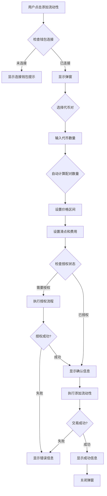
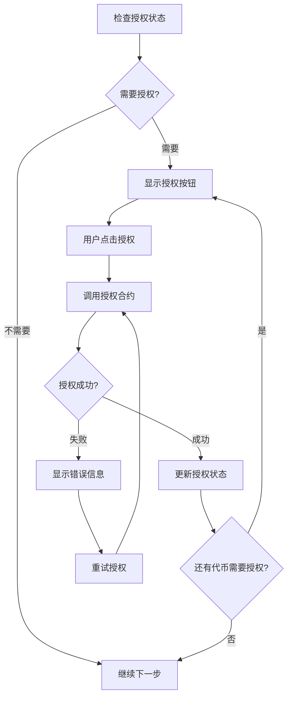
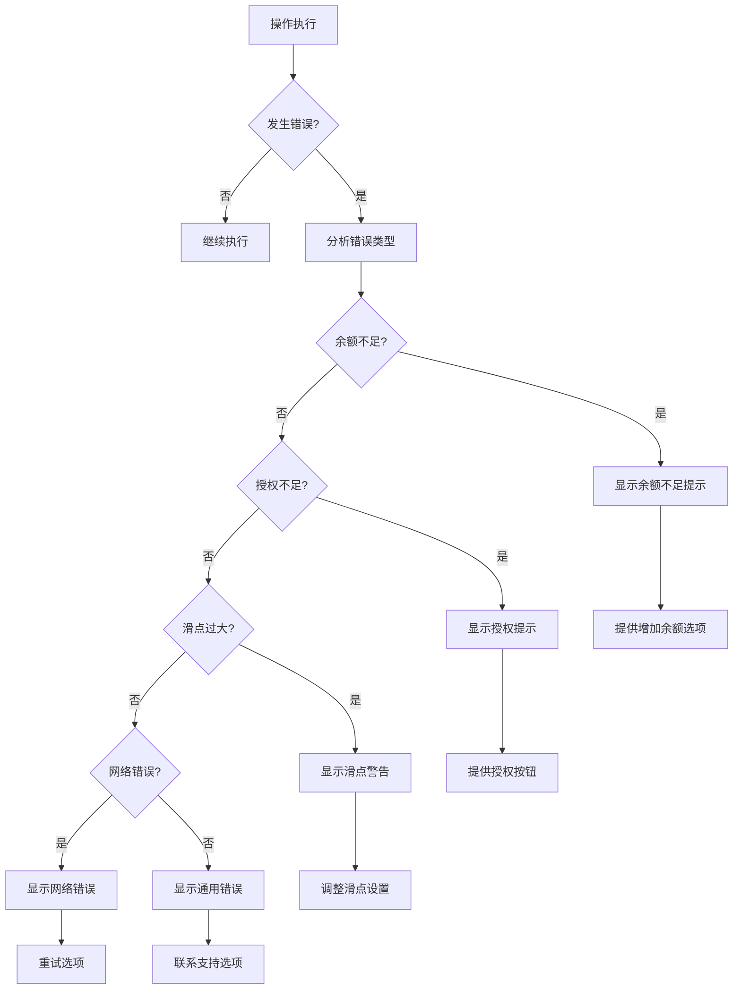

# Uniswap V3 添加流动性弹窗设计方案

## 📋 设计概述

本文档详细设计了用于 pools 页面的 Uniswap V3 添加流动性弹窗，包括用户界面、交互流程、技术实现和用户体验优化。

## 🎯 设计目标

### 用户体验目标
- ✅ **简化操作**: 一站式添加流动性，自动处理复杂流程
- ✅ **实时反馈**: 显示价格、滑点、费用等关键信息
- ✅ **安全保护**: 滑点保护、余额检查、授权管理
- ✅ **视觉清晰**: 现代化 UI 设计，信息层次分明

### 功能目标
- ✅ **代币选择**: 支持 USDT/WETH 交易对
- ✅ **数量输入**: 智能计算配对数量
- ✅ **价格区间**: 直观的 tick range 设置
- ✅ **费用设置**: 灵活的滑点和手续费配置
- ✅ **授权管理**: 自动检测和处理代币授权

## 🎨 UI 设计方案

### 1. 弹窗布局结构

```
┌─────────────────────────────────────────┐
│  添加流动性                    [✕]     │
├─────────────────────────────────────────┤
│                                         │
│  🎯 选择代币对                          │
│  ┌─────────────┬─────────────┐          │
│  │    USDT     │     WETH    │          │
│  │   1,000.00  │     0.50    │          │
│  └─────────────┴─────────────┘          │
│                                         │
│  📊 价格区间设置                        │
│  ┌───────────────────────────────────┐  │
│  │  当前价格: $2,000.00              │  │
│  │  价格区间: [$1,800 - $2,200]      │  │
│  │  ▓▓▓▓▓▓▓▓▓▓▓▓▓▓▓▓▓▓▓▓▓▓▓      │  │
│  │  [窄幅] [标准] [宽幅] [自定义]      │  │
│  └───────────────────────────────────┘  │
│                                         │
│  ⚙️ 费用设置                            │
│  ┌───────────────────────────────────┐  │
│  │  滑点容忍度: 1.0%                   │  │
│  │  ████████░░ 80%                   │  │
│  │                                    │  │
│  │  预估费用: 0.005 ETH                │  │
│  └───────────────────────────────────┘  │
│                                         │
│  💰 汇总信息                           │
│  ┌───────────────────────────────────┐  │
│  │  USDT 投入: 1,000.00               │  │
│  │  WETH 投入: 0.50                   │  │
│  │  最小 USDT: 990.00 (1% 滑点)       │  │
│  │  最小 WETH: 0.495 (1% 滑点)       │  │
│  │                                    │  │
│  │  授权状态: ✅USDT ✅WETH           │  │
│  │  预估收益: 8.92% APY                │  │
│  └───────────────────────────────────┘  │
│                                         │
│  [取消]              [添加流动性]        │
└─────────────────────────────────────────┘
```

### 2. 视觉设计规范

#### 配色方案
```css
/* 主色调 */
--primary-gradient: linear-gradient(135deg, #FF6B6B, #4ECDC4);
--secondary-color: #2C3E50;
--accent-color: #E74C3C;

/* 状态色彩 */
--success-color: #27AE60;
--warning-color: #F39C12;
--error-color: #E74C3C;
--info-color: #3498DB;

/* 背景色 */
--modal-bg: rgba(15, 15, 15, 0.95);
--card-bg: #1a1a1a;
--input-bg: #2d2d2d;
--border-color: #3d3d3d;
```

#### 组件样式
```css
/* 弹窗容器 */
.liquidity-modal {
  background: var(--modal-bg);
  backdrop-filter: blur(10px);
  border: 1px solid var(--border-color);
  border-radius: 16px;
  box-shadow: 0 25px 50px -12px rgba(0, 0, 0, 0.5);
}

/* 输入框 */
.token-input {
  background: var(--input-bg);
  border: 2px solid var(--border-color);
  border-radius: 12px;
  padding: 16px;
  transition: all 0.3s ease;
}

.token-input:focus {
  border-color: var(--accent-color);
  box-shadow: 0 0 0 3px rgba(231, 76, 60, 0.1);
}

/* 按钮 */
.primary-button {
  background: var(--primary-gradient);
  border: none;
  border-radius: 12px;
  padding: 14px 24px;
  font-weight: 600;
  transition: all 0.3s ease;
}

.primary-button:hover {
  transform: translateY(-2px);
  box-shadow: 0 10px 25px -5px rgba(0, 0, 0, 0.3);
}

/* 价格区间滑块 */
.price-range-slider {
  background: linear-gradient(
    90deg,
    #3498DB 0%,
    #2ECC71 25%,
    #F39C12 50%,
    #E74C3C 75%,
    #9B59B6 100%
  );
  height: 6px;
  border-radius: 3px;
  position: relative;
}
```

## 🔧 技术实现方案

### 1. 组件结构

```typescript
// 主弹窗组件
interface UniswapLiquidityModalProps {
  isOpen: boolean;
  onClose: () => void;
  onSuccess?: (result: LiquidityResult) => void;
  defaultToken0?: Address;
  defaultToken1?: Address;
}

// 子组件结构
├── UniswapLiquidityModal          // 主弹窗
├── TokenSelector                  // 代币选择器
├── AmountInputs                   // 数量输入组件
├── PriceRangeSelector            // 价格区间选择器
├── FeeSettings                   // 费用设置组件
├── ApprovalStatus                 // 授权状态组件
├── SummaryInfo                   // 汇总信息组件
└── TransactionProgress           // 交易进度组件
```

### 2. 状态管理

```typescript
interface LiquidityModalState {
  // 代币状态
  token0: TokenInfo;
  token1: TokenInfo;

  // 数量状态
  amount0: string;
  amount1: string;
  amount0Min: string;
  amount1Min: string;

  // 价格区间状态
  priceRange: {
    tickLower: number;
    tickUpper: number;
    type: 'narrow' | 'standard' | 'wide' | 'custom';
  };

  // 费用设置
  slippage: number;
  deadline: number;

  // 授权状态
  approvals: {
    token0: boolean;
    token1: boolean;
    nft: boolean;
  };

  // 交易状态
  isApproving: boolean;
  isAddingLiquidity: boolean;
  transactionHash?: string;

  // 错误状态
  error: string | null;
  warnings: string[];
}
```

### 3. 核心功能实现

#### 代币选择器
```typescript
const TokenSelector: React.FC<TokenSelectorProps> = ({
  selectedToken,
  onSelect,
  disabled,
  tokenType
}) => {
  const { formattedBalances } = useUniswapTokens();

  return (
    <div className="token-selector">
      <div className="token-icon">
        
      </div>
      <div className="token-info">
        <div className="token-symbol">{selectedToken.symbol}</div>
        <div className="token-balance">
          余额: {formattedBalances[`${tokenType}Balance`]}
        </div>
      </div>
      {!disabled && (
        <button onClick={() => onSelect(tokenType)}>
          <SwapIcon />
        </button>
      )}
    </div>
  );
};
```

#### 智能数量计算
```typescript
const useLiquidityCalculation = (token0, token1, currentPrice) => {
  const calculateAmount1 = useCallback((amount0: string) => {
    const amount0BN = parseUnits(amount0, token0.decimals);
    const amount1BN = (amount0BN * BigInt(Math.floor(currentPrice * 1e18))) / BigInt(1e18);
    return formatUnits(amount1BN, token1.decimals);
  }, [token0, token1, currentPrice]);

  const calculateAmount0 = useCallback((amount1: string) => {
    const amount1BN = parseUnits(amount1, token1.decimals);
    const amount0BN = (amount1BN * BigInt(1e18)) / BigInt(Math.floor(currentPrice * 1e18));
    return formatUnits(amount0BN, token0.decimals);
  }, [token0, token1, currentPrice]);

  return { calculateAmount1, calculateAmount0 };
};
```

#### 价格区间选择器
```typescript
const PriceRangeSelector: React.FC = () => {
  const [selectedRange, setSelectedRange] = useState<RangeType>('standard');
  const [customRange, setCustomRange] = useState({ lower: -60000, upper: 60000 });

  const rangePresets = {
    narrow: { lower: -3000, upper: 3000, width: '±0.1%' },
    standard: { lower: -60000, upper: 60000, width: '±2%' },
    wide: { lower: -120000, upper: 120000, width: '±4%' },
    custom: { lower: customRange.lower, upper: customRange.upper, width: '自定义' }
  };

  return (
    <div className="price-range-selector">
      <div className="current-price">
        当前价格: ${currentPrice.toFixed(2)}
      </div>

      <div className="range-presets">
        {Object.entries(rangePresets).map(([type, preset]) => (
          <button
            key={type}
            className={`preset-button ${selectedRange === type ? 'active' : ''}`}
            onClick={() => setSelectedRange(type as RangeType)}
          >
            {type === 'narrow' && '窄幅'}
            {type === 'standard' && '标准'}
            {type === 'wide' && '宽幅'}
            {type === 'custom' && '自定义'}
            <span className="range-width">{preset.width}</span>
          </button>
        ))}
      </div>

      {selectedRange === 'custom' && (
        <div className="custom-range-inputs">
          <div className="tick-input">
            <label>Tick 下限</label>
            <input
              type="number"
              value={customRange.lower}
              onChange={(e) => setCustomRange({...customRange, lower: Number(e.target.value)})}
            />
          </div>
          <div className="tick-input">
            <label>Tick 上限</label>
            <input
              type="number"
              value={customRange.upper}
              onChange={(e) => setCustomRange({...customRange, upper: Number(e.target.value)})}
            />
          </div>
        </div>
      )}

      <div className="price-range-visualization">
        <PriceRangeChart
          currentPrice={currentPrice}
          range={rangePresets[selectedRange]}
        />
      </div>
    </div>
  );
};
```

## 🔄 交互流程设计

### 1. 主要流程图



### 2. 授权处理流程



### 3. 错误处理流程



## 📱 响应式设计

### 桌面端 (≥1024px)
- 弹窗宽度: 640px
- 两列布局代币输入
- 完整的价格区间可视化
- 侧边详情面板

### 平板端 (768px - 1023px)
- 弹窗宽度: 90vw (最大 640px)
- 单列布局
- 简化的价格区间选择
- 折叠式详情信息

### 移动端 (<768px)
- 弹窗宽度: 95vw
- 垂直堆叠布局
- 简化版价格区间选择
- 底部固定操作按钮

## 🔍 细节交互设计

### 1. 实时价格更新
```typescript
// 每5秒更新一次价格
useEffect(() => {
  const interval = setInterval(async () => {
    const newPrice = await getCurrentPrice(token0, token1);
    setCurrentPrice(newPrice);

    // 如果用户已输入数量，重新计算配对数量
    if (amount0) {
      setAmount1(calculateAmount1(amount0, newPrice));
    }
  }, 5000);

  return () => clearInterval(interval);
}, [token0, token1, amount0]);
```

### 2. 智能滑点建议
```typescript
const suggestSlippage = (pairVolatility: number, tradeSize: number) => {
  if (pairVolatility < 0.02 && tradeSize < 1000) return 0.5;  // 低波动，小额交易
  if (pairVolatility < 0.05 && tradeSize < 5000) return 1.0;  // 中等波动
  return 2.0;  // 高波动或大额交易
};
```

### 3. Gas 费用估算
```typescript
const estimateGasFee = async (params: LiquidityParams) => {
  try {
    const estimate = await uniswapContract.estimateGas.addLiquidity(params);
    const 
     = await provider.getGasPrice();

    return {
      gas: estimate,
      gasPrice,
      totalFee: estimate * gasPrice,
      totalFeeETH: formatEther(estimate * gasPrice)
    };
  } catch (error) {
    console.error('Gas 估算失败:', error);
    return null;
  }
};
```

## 🎯 用户体验优化

### 1. 渐进式信息披露
- **新手模式**: 隐藏高级选项，提供预设配置
- **标准模式**: 显示常用选项，允许自定义
- **专家模式**: 显示所有参数，完全自定义

### 2. 智能提示系统
- **余额警告**: 当输入金额超过可用余额
- **价格提示**: 当价格偏离市场价过多
- **费用提醒**: 当滑点或 gas 费用过高

### 3. 操作反馈
- **加载状态**: 清晰的进度指示
- **成功确认**: 交易成功的详细反馈
- **错误指导**: 具体的错误原因和解决方案

## 🧪 测试策略

### 1. 单元测试
```typescript
describe('UniswapLiquidityModal', () => {
  it('should calculate correct paired amounts', () => {
    // 测试代币配对数量计算
  });

  it('should handle slippage calculation', () => {
    // 测试滑点计算
  });

  it('should validate input amounts', () => {
    // 测试输入验证
  });
});
```

### 2. 集成测试
```typescript
describe('Liquidity Modal Integration', () => {
  it('should complete full liquidity flow', async () => {
    // 测试完整的添加流动性流程
  });

  it('should handle approval flow', async () => {
    // 测试授权流程
  });
});
```

### 3. E2E 测试
```typescript
describe('E2E Liquidity Modal', () => {
  it('should allow user to add liquidity from start to finish', async () => {
    // 端到端测试
  });
});
```

## 📊 性能优化

### 1. 组件优化
- 使用 `React.memo` 避免不必要的重渲染
- 实现虚拟滚动处理大量数据
- 使用 `useCallback` 缓存事件处理函数

### 2. 数据优化
- 实现智能缓存减少 API 调用
- 使用防抖处理频繁的输入变化
- 预加载常用数据提高响应速度

### 3. 动画优化
- 使用 CSS transform 而不是 position
- 实现硬件加速
- 合理使用动画减少性能影响

## 🚀 实现优先级

### Phase 1: 核心功能 (MVP)
- [ ] 基础弹窗结构
- [ ] 代币选择和数量输入
- [ ] 价格区间选择 (预设选项)
- [ ] 授权状态检查和处理
- [ ] 基础添加流动性功能

### Phase 2: 用户体验优化
- [ ] 实时价格更新
- [ ] 智能滑点建议
- [ ] Gas 费用估算
- [ ] 错误处理和重试机制
- [ ] 交易进度显示

### Phase 3: 高级功能
- [ ] 自定义价格区间
- [ ] 高级费用设置
- [ ] 流动性分析工具
- [ ] 历史收益展示
- [ ] 批量操作支持

---

**文档版本**: 1.0.0
**创建日期**: 2025-10-10
**维护者**: CryptoStock 开发团队