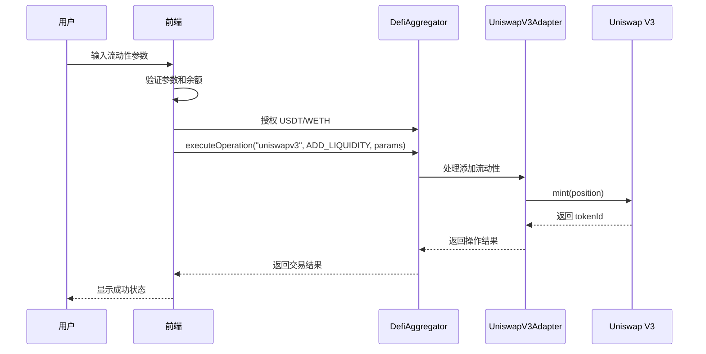

# Uniswap V3 前端集成完整指南

## 📖 概述

本文档详细介绍了如何在 CryptoStock 前端项目中集成和使用 Uniswap V3 功能，包括流动性管理、交易操作和最佳实践。

## 🏗️ 架构设计

### 系统架构

```
Frontend (React + TypeScript)
    ↓
DefiAggregator (统一入口)
    ↓
UniswapV3Adapter (专用适配器)
    ↓
Uniswap V3 Protocol (流动性池)
```

### 核心组件

1. **DefiAggregator**: 统一管理所有 DeFi 操作的入口合约
2. **UniswapV3Adapter**: 专门处理 Uniswap V3 操作的适配器
3. **MockPositionManager**: 管理流动性位置 NFT
4. **Token Contracts**: USDT 和 WETH 代币合约

## 🔧 配置和部署

### 1. 合约地址配置

合约地址信息存储在 `deployments-uniswapv3-adapter-sepolia.json`:

```json
{
  "network": "sepolia",
  "chainId": "11155111",
  "contracts": {
    "DefiAggregator": "0xD93D27d031FdF461288c904688Dd78D6902eA315",
    "UniswapV3Adapter": "0x0Da05F4753534669dCE540C1Bfc348f6728Bedb3",
    "MockERC20_USDT": "0xd7C597Cf30fb56162AEDAe8a52927B7CE4076e5B",
    "MockWethToken": "0x6a1B8536678C42cacf9e2c6502bffe288c84c8bA",
    "MockPositionManager": "0x8B5E5C5aA9FF2a3b17a5A9e5D6E30071Ba6BE74C"
  },
  "feeRateBps": 30
}
```

### 2. 环境要求

- **Node.js**: 18+
- **Network**: Sepolia Testnet
- **Wallet**: MetaMask 或兼容的钱包
- **Chain**: Ethereum Sepolia (Chain ID: 11155111)

## 💻 前端实现

### 1. Store 状态管理

使用 Zustand 进行状态管理，主要文件：
- `lib/stores/useUniswapStore.ts` - 核心状态管理
- `lib/stores/uniswapStore.ts` - 备用状态管理
- `lib/hooks/useUniswap.ts` - 主要 Hook
- `lib/hooks/useUniswapWithClients.ts` - 客户端集成 Hook

### 2. 核心功能组件

#### UniswapLiquidityModal

主要流动性管理组件，位置：`components/UniswapLiquidityModal.tsx`

**功能特性**：
- ✅ 代币对选择和交换
- ✅ 流动性数量输入和自动计算
- ✅ 价格区间设置（预设 + 自定义）
- ✅ 滑点容忍度配置
- ✅ 授权流程集成
- ✅ 实时余额显示
- ✅ 交易状态追踪

**使用方式**：
```tsx
import { UniswapLiquidityModal } from '@/components/UniswapLiquidityModal';

function MyComponent() {
  const [isOpen, setIsOpen] = useState(false);

  return (
    <UniswapLiquidityModal
      isOpen={isOpen}
      onClose={() => setIsOpen(false)}
      onSuccess={(result) => {
        console.log('添加流动性成功:', result);
      }}
      defaultToken0="USDT"
      defaultToken1="WETH"
    />
  );
}
```

### 3. Hook 使用指南

#### 基础 Hook

```typescript
import { useUniswap } from '@/lib/hooks/useUniswap';

function MyComponent() {
  const {
    // 基础状态
    isConnected,
    address,
    isLoading,
    isOperating,
    error,

    // 合约信息
    defiAggregatorAddress,
    uniswapV3AdapterAddress,
    poolInfo,

    // 用户信息
    userBalance,
    formattedBalances,
    needsApproval,
    maxBalances,

    // 位置信息
    userPositions,
    selectedPosition,
    formattedPositions,
    totalTVL,
    totalFees,

    // 初始化
    initializeUniswapTrading,
    refreshUserInfo,

    // 授权方法
    approveUSDT,
    approveWETH,
    approveNFT,

    // 交易方法
    addLiquidity,
    removeLiquidity,
    collectFees,

    // 辅助方法
    selectPosition,
    setError,
    clearErrors,
  } = useUniswap();

  return <div>...</div>;
}
```

#### 专用 Hooks

```typescript
// 代币管理
import { useUniswapTokens } from '@/lib/hooks/useUniswap';
const { userBalance, formattedBalances, needsApproval, approveUSDT, approveWETH } = useUniswapTokens();

// 位置管理
import { useUniswapPositions } from '@/lib/hooks/useUniswap';
const { userPositions, selectedPosition, fetchUserPositions } = useUniswapPositions();

// 操作管理
import { useUniswapOperations } from '@/lib/hooks/useUniswap';
const { addLiquidity, removeLiquidity, collectFees } = useUniswapOperations();
```

## 🔄 操作流程

### 1. 添加流动性流程



### 2. 关键步骤详解

#### 步骤 1: 参数验证
```typescript
const validateAddLiquidityParams = (params) => {
  // 检查代币地址有效性
  if (!params.token0 || !params.token1) throw new Error('无效的代币地址');

  // 检查数量
  if (parseFloat(params.amount0) <= 0 || parseFloat(params.amount1) <= 0) {
    throw new Error('数量必须大于 0');
  }

  // 检查余额充足性
  if (parseFloat(params.amount0) > parseFloat(balance0)) {
    throw new Error(`${token0.symbol} 余额不足`);
  }

  return true;
};
```

#### 步骤 2: 代币排序
```typescript
// Uniswap V3 要求 token0 地址 < token1 地址
const sortTokens = (tokenA, tokenB) => {
  if (tokenA.toLowerCase() < tokenB.toLowerCase()) {
    return { token0: tokenA, token1: tokenB };
  } else {
    return { token0: tokenB, token1: tokenA };
  }
};
```

#### 步骤 3: ExtraData 编码
```typescript
// 价格区间参数编码
const encodePriceRange = (tickLower, tickUpper) => {
  return encodeAbiParameters(
    [{ type: 'int24' }, { type: 'int24' }],
    [tickLower, tickUpper]
  );
};
```

#### 步骤 4: 授权流程
```typescript
// 授权代币给 DefiAggregator
const approveTokens = async () => {
  await approveUSDT(amount0);
  await approveWETH(amount1);

  // 验证授权状态
  const allowances = await fetchAllowances();
  if (allowances.usdtAllowance < parseUnits(amount0, 6) ||
      allowances.wethAllowance < parseUnits(amount1, 18)) {
    throw new Error('授权失败');
  }
};
```

#### 步骤 5: 执行操作
```typescript
const operationParams = {
  tokens: [sortedToken0, sortedToken1],
  amounts: [
    parseUnits(amount0, token0Decimals),
    parseUnits(amount1, token1Decimals),
    parseUnits(amount0Min, token0Decimals),
    parseUnits(amount1Min, token1Decimals),
  ],
  recipient: userAddress,
  deadline: Math.floor(Date.now() / 1000) + 3600,
  tokenId: BigInt(0),
  extraData: encodePriceRange(tickLower, tickUpper),
};

const result = await defiAggregator.executeOperation(
  'uniswapv3',
  UniswapOperationType.ADD_LIQUIDITY, // 2
  operationParams
);
```

## 📊 状态管理

### 1. 状态结构

```typescript
interface UniswapState {
  // 基础状态
  defiAggregatorAddress: Address | null;
  uniswapV3AdapterAddress: Address | null;
  poolInfo: UniswapPoolInfo | null;
  userBalance: UserBalanceInfo | null;
  userPositions: UniswapPositionInfo[];

  // 操作状态
  isLoading: boolean;
  isOperating: boolean;
  error: string | null;
}
```

### 2. 主要 Actions

```typescript
// 初始化
initializeContracts(defiAggregatorAddress, uniswapV3AdapterAddress)
initFromDeployment()

// 数据获取
fetchPoolInfo(publicClient)
fetchUserBalance(publicClient, userAddress)
fetchUserPositions(publicClient, userAddress)

// 授权操作
approveUSDT(publicClient, walletClient, chain, amount, account)
approveWETH(publicClient, walletClient, chain, amount, account)

// 交易操作
addLiquidity(publicClient, walletClient, chain, params, account)
removeLiquidity(publicClient, walletClient, chain, params, account)
collectFees(publicClient, walletClient, chain, params, account)
```

## 🎨 UI 组件指南

### 1. 价格区间设置

```typescript
const PRICE_RANGES: PriceRange[] = [
  { tickLower: -3000, tickUpper: 3000, type: 'narrow', name: '窄幅', description: '±0.1%' },
  { tickLower: -60000, tickUpper: 60000, type: 'standard', name: '标准', description: '±2%' },
  { tickLower: -120000, tickUpper: 120000, type: 'wide', name: '宽幅', description: '±4%' },
];

// 自定义价格区间
const [customRange, setCustomRange] = useState({ lower: -60000, upper: 60000 });
```

### 2. 滑点设置

```typescript
const [slippage, setSlippage] = useState(1.0); // 1% 默认滑点

const calculateMinAmounts = (amount0, amount1, slippage) => {
  const amount0Min = amount0 * (1 - slippage / 100);
  const amount1Min = amount1 * (1 - slippage / 100);
  return { amount0Min, amount1Min };
};
```

### 3. 余额显示

```typescript
const formatBalance = (balance, decimals, symbol) => {
  return `${formatUnits(balance, decimals)} ${symbol}`;
};

// 使用示例
<div className="balance-display">
  <span>余额: {formatBalance(userBalance.usdtBalance, 6, 'USDT')}</span>
  <span>余额: {formatBalance(userBalance.wethBalance, 18, 'WETH')}</span>
</div>
```

## ⚠️ 错误处理和最佳实践

### 1. 常见错误

#### 错误 1: "execution reverted"
**原因**: 授权目标不正确
**解决**: 确保授权给 `DefiAggregator` 而不是 `UniswapV3Adapter`

```typescript
// ❌ 错误方式
await tokenContract.approve(uniswapV3AdapterAddress, amount);

// ✅ 正确方式
await tokenContract.approve(defiAggregatorAddress, amount);
```

#### 错误 2: 代币顺序错误
**原因**: Uniswap V3 要求 token0 地址 < token1 地址
**解决**: 自动排序代币

```typescript
const sortTokensForUniswap = (tokenA, tokenB) => {
  return tokenA.toLowerCase() < tokenB.toLowerCase()
    ? [tokenA, tokenB]
    : [tokenB, tokenA];
};
```

#### 错误 3: ExtraData 编码错误
**原因**: ABI 编码格式不匹配
**解决**: 使用正确的编码方式

```typescript
// ❌ 错误方式
const buffer = Buffer.alloc(8);
buffer.writeInt32LE(tickLower, 0);
buffer.writeInt32LE(tickUpper, 4);

// ✅ 正确方式
const extraData = encodeAbiParameters(
  [{ type: 'int24' }, { type: 'int24' }],
  [tickLower, tickUpper]
);
```

### 2. 最佳实践

#### 授权管理
```typescript
// 检查授权状态
const checkApprovalStatus = async (token, spender, amount) => {
  const allowance = await tokenContract.allowance(userAddress, spender);
  return allowance >= amount;
};

// 批量授权
const approveMultipleTokens = async (tokens, spender, amounts) => {
  const approvals = tokens.map((token, index) =>
    approveToken(token, spender, amounts[index])
  );
  await Promise.all(approvals);
};
```

#### 错误重试
```typescript
const addLiquidityWithRetry = async (params, maxRetries = 3) => {
  for (let i = 0; i < maxRetries; i++) {
    try {
      return await addLiquidity(params);
    } catch (error) {
      if (i === maxRetries - 1) throw error;

      // 等待一段时间后重试
      await new Promise(resolve => setTimeout(resolve, 2000));
    }
  }
};
```

#### Gas 优化
```typescript
const gasConfig = {
  gas: 8000000n, // 8M gas limit
  maxFeePerGas: 100000000000n, // 100 Gwei
  maxPriorityFeePerGas: 5000000000n, // 5 Gwei
};
```

## 🔍 调试和监控

### 1. 日志记录

```typescript
// 操作日志
console.log('🚀 开始添加流动性...', { amount0, amount1, tickLower, tickUpper });

// 交易日志
console.log('📝 交易哈希:', hash);
console.log('⏳ 等待交易确认...');

// 结果日志
console.log('✅ 添加流动性成功:', result);
```

### 2. 状态监控

```typescript
// 监听操作状态
useEffect(() => {
  if (isOperating) {
    console.log('⏳ 操作进行中...');
  }
}, [isOperating]);

// 监听错误状态
useEffect(() => {
  if (error) {
    console.error('❌ 操作失败:', error);
    // 显示错误提示
    showToast(`操作失败: ${error}`, 'error');
  }
}, [error]);
```

### 3. 事件监听

```typescript
// 监听 OperationExecuted 事件
const listenToOperationEvents = () => {
  const contract = new Contract(defiAggregatorAddress, DefiAggregatorABI, provider);

  contract.on('OperationExecuted', (user, operationType, tokens, amounts, returnData) => {
    console.log('📊 操作执行事件:', { user, operationType, tokens, amounts });

    if (operationType === UniswapOperationType.ADD_LIQUIDITY) {
      // 解析 tokenId
      const tokenId = decodeAbiParameters(['uint256'], returnData)[0];
      console.log('🎫 新的流动性位置 Token ID:', tokenId.toString());
    }
  });
};
```

## 📋 测试清单

### 功能测试

- [ ] 连接钱包功能
- [ ] 余额显示正确性
- [ ] 代币授权流程
- [ ] 添加流动性操作
- [ ] 移除流动性操作
- [ ] 收取手续费操作
- [ ] 价格区间设置
- [ ] 滑点配置
- [ ] 错误处理

### 边界测试

- [ ] 零余额操作
- [ ] 超额余额操作
- [ ] 极端滑点设置
- [ ] 网络延迟情况
- [ ] 交易失败处理

### 性能测试

- [ ] 大额交易处理
- [ ] 并发操作处理
- [ ] 内存使用优化
- [ ] 加载状态显示

## 🚀 部署指南

### 1. 环境配置

```bash
# 安装依赖
npm install

# 环境变量配置
cp .env.example .env.local

# 启动开发服务器
npm run dev
```

### 2. 合约部署

```bash
# 部署 Uniswap V3 适配器
npx hardhat run scripts/deploy-uniswapv3-adapter-only.js --network sepolia

# 更新前端配置文件
cp deployments-uniswapv3-adapter-sepolia.json lib/abi/
```

### 3. 生产环境

```bash
# 构建生产版本
npm run build

# 启动生产服务器
npm run start
```

## 📚 API 参考

### 主要 Hook

| Hook | 描述 | 用法 |
|------|------|------|
| `useUniswap()` | 主要 Hook，提供所有功能 | `const uniswap = useUniswap();` |
| `useUniswapTokens()` | 代币管理 | `const { approveUSDT } = useUniswapTokens();` |
| `useUniswapPositions()` | 位置管理 | `const { userPositions } = useUniswapPositions();` |
| `useUniswapOperations()` | 操作管理 | `const { addLiquidity } = useUniswapOperations();` |

### 操作类型

```typescript
export enum UniswapOperationType {
  ADD_LIQUIDITY = 2,    // 添加流动性
  REMOVE_LIQUIDITY = 3, // 移除流动性
  COLLECT_FEES = 18,    // 收取手续费
}
```

### 参数类型

```typescript
interface AddLiquidityParams {
  token0: Address;
  token1: Address;
  amount0: string;
  amount1: string;
  amount0Min: string;
  amount1Min: string;
  tickLower?: number;
  tickUpper?: number;
  recipient: Address;
  deadline?: number;
}
```

## 🤝 贡献指南

### 代码规范

- 使用 TypeScript 严格模式
- 遵循 ESLint 规则
- 使用 Prettier 格式化
- 添加适当的注释和文档

### 提交流程

1. Fork 项目
2. 创建功能分支
3. 提交更改
4. 创建 Pull Request
5. 等待代码审查

## 📞 支持

如有问题或建议，请：

1. 查看本文档的故障排除部分
2. 检查控制台错误信息
3. 联系开发团队
4. 在 Issues 中报告问题

---

**最后更新**: 2025-10-10
**版本**: 1.0.0
**维护者**: CryptoStock 开发团队