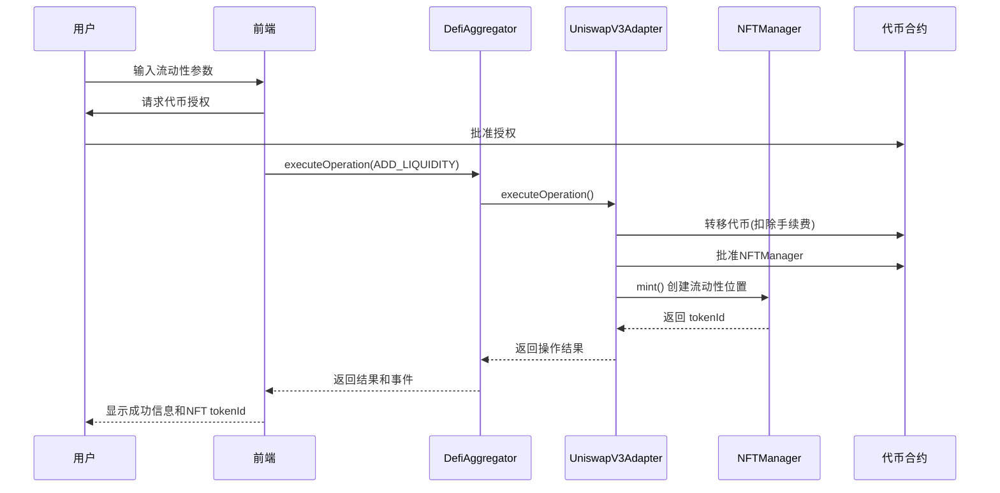
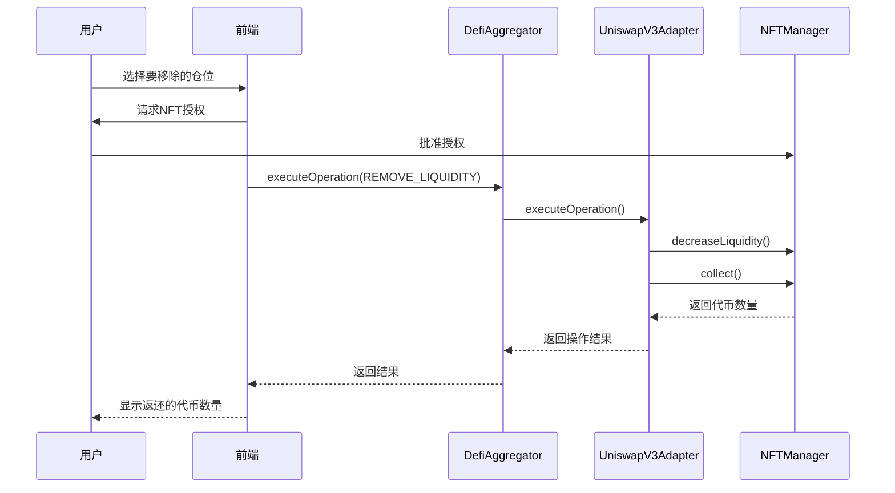
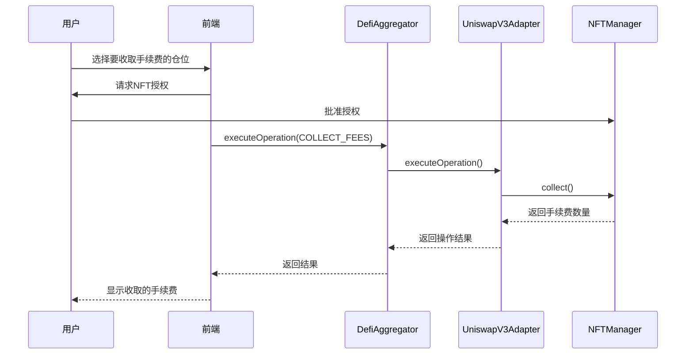

# Uniswap V3 适配器实现文档

## 概述

本文档详细描述了 CryptoStock 平台中 Uniswap V3 适配器的完整实现，包括合约架构、API 接口、部署配置和前端集成方案。

## 📋 目录

- [架构概览](#架构概览)
- [合约实现](#合约实现)
- [API 接口](#api-接口)
- [部署配置](#部署配置)
- [测试用例](#测试用例)
- [前端集成](#前端集成)
- [操作流程](#操作流程)
- [安全考虑](#安全考虑)

## 🏗️ 架构概览

### 系统架构

```
┌─────────────────┐    ┌──────────────────┐    ┌─────────────────────┐
│   前端界面       │    │   DefiAggregator  │    │  UniswapV3Adapter   │
│   (React/Next)   │◄──►│   (聚合器合约)     │◄──►│   (适配器合约)       │
└─────────────────┘    └──────────────────┘    └─────────────────────┘
                                                        │
                                                        ▼
                                              ┌─────────────────────┐
                                              │ MockPositionManager │
                                              │ (NFT流动性管理器)    │
                                              └─────────────────────┘
                                                        │
                                                        ▼
                                              ┌─────────────────────┐
                                              │  MockERC20 Tokens   │
                                              │  (USDT/WETH)        │
                                              └─────────────────────┘
```

### 核心组件

1. **UniswapV3Adapter.sol** - 核心适配器合约
2. **DefiAggregator.sol** - 操作聚合器
3. **MockNonfungiblePositionManager.sol** - NFT流动性位置管理
4. **MockERC20.sol** - 代币合约 (USDT, WETH)

## 📄 合约实现

### UniswapV3Adapter.sol

**主要功能**：
- 流动性添加/移除
- 手续费收取
- NFT 位置管理
- 手续费计算和收取

**继承接口**：
```solidity
contract UniswapV3Adapter is
    Initializable,
    OwnableUpgradeable,
    UUPSUpgradeable,
    PausableUpgradeable,
    ReentrancyGuardUpgradeable,
    IERC721Receiver,
    IDefiAdapter
```

#### 核心状态变量

```solidity
address public positionManager;    // NFT位置管理器地址
address public usdtToken;          // USDT代币地址
address public wethToken;          // WETH代币地址
```

#### 支持的操作类型

| 操作类型 | 枚举值 | 描述 |
|---------|--------|------|
| ADD_LIQUIDITY | 2 | 添加流动性 |
| REMOVE_LIQUIDITY | 3 | 移除流动性 |
| COLLECT_FEES | 18 | 收取手续费 |

### 初始化函数

```solidity
function initialize(
    address _positionManager,
    address _usdtToken,
    address _wethTok
    address _owner
) external initializer
```

**参数说明**：
- `_positionManager`: NFT流动性位置管理器地址
- `_usdtToken`: USDT代币地址
- `_wethToken`: WETH代币地址
- `_ow
ner`: 合约所有者地址

## 🔌 API 接口

### 添加流动性

**函数签名**：
```solidity
function _handleAddLiquidity(
    OperationParams calldata params,
    uint24 feeRateBps
) internal returns (OperationResult memory result)
```

**参数结构**：
```javascript
{
    tokens: [usdtAddress, wethAddress],        // 代币地址数组
    amounts: [usdtAmount, wethAmount,          // [token0数量, token1数量,
             usdtMinAmount, wethMinAmount],    //  token0最小数量, token1最小数量]
    recipient: userAddress,                    // 接收者地址
    deadline: timestamp,                       // 截止时间
    tokenId: 0,                                // 新建流动性位置设为0
    extraData: "0x..."                         // 可选价格区间参数
}
```

**extraData 编码**（可选）：
```javascript
// 自定义价格区间
const tickLower = -60000;
const tickUpper = 60000;
const extraData = ethers.AbiCoder.defaultAbiCoder().encode(
    ['int24', 'int24'],
    [tickLower, tickUpper]
);
```

**返回结果**：
```javascript
{
    success: true,
    outputAmounts: [tokenId],    // 新创建的NFT tokenId
    message: "Add liquidity successful",
    returnData: "0x..."          // ABI编码的tokenId
}
```

### 移除流动性

**函数签名**：
```solidity
function _handleRemoveLiquidity(
    OperationParams calldata params,
    uint24 feeRateBps
) internal returns (OperationResult memory result)
```

**参数结构**：
```javascript
{
    tokens: [usdtAddress],        // 占位符地址
    amounts: [amount0Min, amount1Min],  // 最小接收数量
    recipient: userAddress,       // 接收者地址
    deadline: timestamp,          // 截止时间
    tokenId: tokenId,             // NFT tokenId
    extraData: "0x"               // 额外数据
}
```

**返回结果**：
```javascript
{
    success: true,
    outputAmounts: [amount0, amount1],  // 实际收到的代币数量
    message: "Remove liquidity successful"
}
```

### 收取手续费

**函数签名**：
```solidity
function _handleCollectFees(
    OperationParams calldata params,
    uint24 feeRateBps
) internal returns (OperationResult memory result)
```

**参数结构**：
```javascript
{
    tokens: [usdtAddress],        // 占位符地址
    amounts: [],                  // 空数组
    recipient: userAddress,       // 接收者地址
    deadline: timestamp,          // 截止时间
    tokenId: tokenId,             // NFT tokenId
    extraData: "0x"               // 额外数据
}
```

**返回结果**：
```javascript
{
    success: true,
    outputAmounts: [feeAmount0, feeAmount1],  // 收取的手续费数量
    message: "Collect fees successful"
}
```

## 🚀 部署配置

### Sepolia 测试网部署信息

```json
{
  "network": "sepolia",
  "chainId": "11155111",
  "deployer": "0x46b43ad9F6C20c400aC17a282022E578417F796A",
  "timestamp": "2025-10-09T01:56:18.110Z",
  "feeRateBps": 30,
  "contracts": {
    "DefiAggregator": "0xD93D27d031FdF461288c904688Dd78D6902eA315",
    "MockERC20_USDT": "0xd7C597Cf30fb56162AEDAe8a52927B7CE4076e5B",
    "MockWethToken": "0x6a1B8536678C42cacf9e2C6502bffe288c84C8bA",
    "MockPositionManager": "0x8B5E5C5aA9FF2a3b17a5A9e5D6E30071Ba6BE74C",
    "UniswapV3Adapter": "0x0Da05F4753534669dCE540C1Bfc348f6728Bedb3",
    "UniswapV3Adapter_Implementation": "0x97C90641a2EF114965258222273d37E1E7e37571"
  },
  "adapterRegistrations": {
    "uniswapv3": "0x0Da05F4753534669dCE540C1Bfc348f6728Bedb3"
  }
}
```

### 合约地址汇总

| 合约名称 | 地址 | 描述 |
|---------|------|------|
| UniswapV3Adapter | `0x0Da05F4753534669dCE540C1Bfc348f6728Bedb3` | 主适配器合约 |
| DefiAggregator | `0xD93D27d031FdF461288c904688Dd78D6902eA315` | 操作聚合器 |
| MockERC20_USDT | `0xd7C597Cf30fb56162AEDAe8a52927B7CE4076e5B` | USDT代币 |
| MockWethToken | `0x6a1B8536678C42cacf9e2C6502bffe288c84C8bA` | WETH代币 |
| MockPositionManager | `0x8B5E5C5aA9FF2a3b17a5A9e5D6E30071Ba6BE74C` | NFT位置管理器 |

## 🧪 测试用例

### 测试文件位置

- **本地测试**: `CryptoStockContract/test/08-uniswapv3.test.js`
- **Sepolia测试**: `CryptoStockContract/test/08-uniswap-sepolia.test.js`

### 测试覆盖范围

1. **添加流动性测试**
   - ✅ 代币转账验证
   - ✅ 手续费计算（1%）
   - ✅ NFT 创建和所有权
   - ✅ 价格区间设置
   - ✅ 流动性数量验证

2. **移除流动性测试**
   - ✅ NFT 授权验证
   - ✅ 流动性移除
   - ✅ 代币返还验证
   - ✅ NFT 状态更新

3. **收取手续费测试**
   - ✅ 手续费累积模拟
   - ✅ 费用收取验证
   - ✅ 余额变化检查

### 测试参数

```javascript
const LIQUIDITY_AMOUNT_TOKEN = ethers.parseUnits("10", 18);    // 10 WETH
const LIQUIDITY_AMOUNT_USDT = ethers.parseUnits("10000", 6);   // 10000 USDT
const FEE_RATE_BPS = 100; // 1% 手续费
```

## 🎨 前端集成

### 推荐目录结构

```
stock-fe/
├── app/
│   └── pools/
│       └── uniswap/
│           └── page.tsx              # Uniswap V3 主页面
├── components/
│   ├── uniswap/
│   │   ├── LiquidityModal.tsx        # 流动性操作弹窗
│   │   ├── PositionCard.tsx          # 仓位卡片
│   │   ├── FeeClaim.tsx              # 手续费收取
│   │   └── PriceRange.tsx            # 价格区间选择
│   └── ui/                           # 共享UI组件
├── lib/
│   ├── contracts/
│   │   ├── UniswapV3Adapter.ts       # 合约交互
│   │   └── types.ts                  # 类型定义
│   └── utils/
│       └── uniswap.ts                # 工具函数
```

### 核心组件实现

#### 1. 流动性操作弹窗

```typescript
interface LiquidityModalProps {
  isOpen: boolean;
  onClose: () => void;
  operation: 'add' | 'remove';
  tokenId?: number;
}

const LiquidityModal: React.FC<LiquidityModalProps> = ({
  isOpen,
  onClose,
  operation,
  tokenId
}) => {
  // 实现添加/移除流动性逻辑
};
```

#### 2. 仓位管理组件

```typescript
interface PositionCardProps {
  tokenId: number;
  position: PositionData;
  onRefresh: () => void;
}

const PositionCard: React.FC<PositionCardProps> = ({
  tokenId,
  position,
  onRefresh
}) => {
  // 显示仓位信息和操作按钮
};
```

### 状态管理

使用 Zustand 进行状态管理：

```typescript
interface UniswapStore {
  positions: Position[];
  isLoading: boolean;
  error: string | null;

  // Actions
  fetchPositions: () => Promise<void>;
  addLiquidity: (params: AddLiquidityParams) => Promise<void>;
  removeLiquidity: (tokenId: number) => Promise<void>;
  collectFees: (tokenId: number) => Promise<void>;
}
```

## 🔄 操作流程

### 添加流动性流程



### 移除流动性流程



### 收取手续费流程



## 🔒 安全考虑

### 智能合约安全

1. **重入攻击防护**
   - 使用 `ReentrancyGuardUpgradeable`
   - 关键操作使用 `nonReentrant` 修饰符

2. **权限控制**
   - `onlyOwner` 修饰符控制管理函数
   - 暂停机制使用 `whenNotPaused` 修饰符

3. **输入验证**
   - 地址零值检查
   - 数组长度验证
   - 数值范围检查

4. **升级安全**
   - UUPS 代理模式
   - 升级权限限制为合约所有者

### 前端安全

1. **用户授权管理**
   - 最小权限原则
   - 授权额度控制
   - 授权状态检查

2. **交易安全**
   - 交易前验证
   - Gas 费用估算
   - 交易状态监控

3. **数据验证**
   - 输入参数验证
   - 服务器响应验证
   - 错误处理机制

### 经济安全

1. **手续费机制**
   - 透明费率（1%）
   - 费用计算公开
   - 费用分配清晰

2. **滑点保护**
   - 最小数量设置
   - 价格影响计算
   - 失败重试机制

## 📊 监控和日志

### 事件监听

```solidity
// 操作执行事件
event OperationExecuted(
    address indexed user,
    OperationType operationType,
    address[] tokens,
    uint256[] amounts,
    bytes returnData
);

// 手续费收取事件
event FeesCollected(
    address indexed user,
    uint256 indexed tokenId,
    uint256 amount0,
    uint256 amount1
);
```

### 监控指标

1. **交易量统计**
   - 日交易量
   - 周交易量
   - 月交易量

2. **流动性指标**
   - 总锁仓价值（TVL）
   - 流动性提供者数量
   - 平均仓位大小

3. **收益指标**
   - 手续费收入
   - 年化收益率（APR）
   - 收益分配统计

## 🛠️ 开发工具

### Hardhat 脚本

```javascript
// 部署脚本
npx hardhat run scripts/deploy-uniswapv3-adapter-only.js --network sepolia

// 测试脚本
npx hardhat test test/08-uniswapv3.test.js
npx hardhat test test/08-uniswap-sepolia.test.js --network sepolia

// 验证合约
npx hardhat verify --network sepolia <CONTRACT_ADDRESS> <CONSTRUCTOR_ARGS>
```

### 前端开发

```bash
# 安装依赖
npm install

# 启动开发服务器
npm run dev

# 构建生产版本
npm run build

# 运行测试
npm run test
```

## 📚 参考资料

- [Uniswap V3 Core Documentation](https://docs.uniswap.org/contracts/v3/core)
- [OpenZeppelin Upgradeable Contracts](https://docs.openzeppelin.com/contracts/4.x/upgradeable)
- [Hardhat Framework](https://hardhat.org/docs)
- [Ethers.js Documentation](https://docs.ethers.org/v5/)

---

**文档版本**: 1.0.0
**最后更新**: 2025-10-10
**维护者**: CryptoStock 开发团队