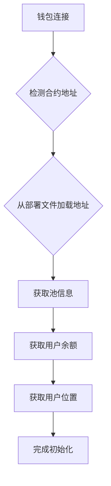
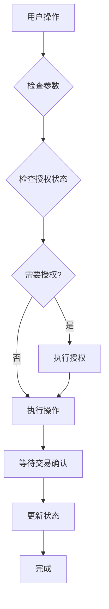
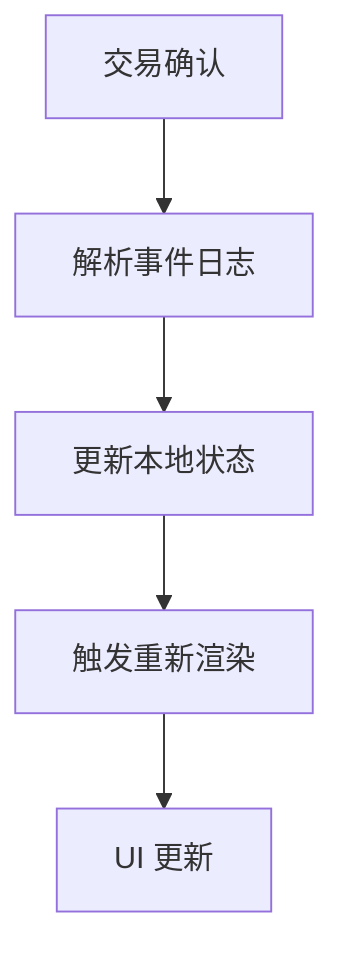

# Uniswap V3 with Clients 使用指南

## 概述

本指南介绍如何使用优化后的 Uniswap V3 Hook 系统，该系统参考了 Aave 的实现模式，提供了与 Web3 客户端的深度集成和简化的 API 接口。

## 📁 文件结构

```
stock-fe/
├── lib/
│   ├── stores/
│   │   └── useUniswapStore.ts          # 🗄️ Zustand 主 store (参考 Aave 模式)
│   └── hooks/
│       ├── useUniswapWithClients.ts   # 🔧 Web3 客户端集成 (参考 Aave 模式)
│       └── useUniswap.ts              # 🎯 简化的主 Hook
└── docs/
    └── uniswap-with-clients-usage.md  # 📚 本使用指南
```

## 🚀 核心改进

### 1. 参考 Aave 模式的架构

- ✅ **客户端集成**: 自动处理 PublicClient 和 WalletClient
- ✅ **类型安全**: 完整的 TypeScript 类型定义
- ✅ **动态配置**: 从部署文件自动加载合约地址
- ✅ **Gas 优化**: EIP-1559 兼容的 gas 配置
- ✅ **错误处理**: 完善的错误处理和状态管理

### 2. 简化的 API 设计

- ✅ **自动初始化**: 连接钱包后自动初始化合约
- ✅ **便捷方法**: 预设 gas 配置和参数验证
- ✅ **状态同步**: 自动更新余额和位置信息
- ✅ **计算属性**: 格式化的显示数据

## 🎯 使用方式

### 主要 Hook - 完整功能

```typescript
import { useUniswap } from '@/lib/hooks/useUniswap';

function UniswapComponent() {
  const {
    // 基础状态
    isConnected,
    address,

    // 用户数据
    userBalance,
    formattedBalances,
    userPositions,
    totalTVL,
    totalFees,

    // 操作方法
    addLiquidity,
    removeLiquidity,
    collectFees,
    approveUSDT,
    approveWETH,

    // 状态
    isLoading,
    isOperating,
    error,
  } = useUniswap();

  // 自动初始化
  const handleInitialize = async () => {
    await initializeUniswapTrading();
  };

  // 添加流动性
  const handleAddLiquidity = async () => {
    try {
      const result = await addLiquidity({
        token0: '0x...', // USDT 地址
        token1: '0x...', // WETH 地址
        amount0: '1000',
        amount1: '0.5',
        amount0Min: '990',   // 1% 滑点
        amount1Min: '0.495',
        tickLower: -60000,
        tickUpper: 60000,
      });

      console.log('添加流动性成功:', result.hash);
    } catch (error) {
      console.error('添加流动性失败:', error);
    }
  };

  return (
    <div>
      {isConnected ? (
        <div>
          <p>总锁仓价值: ${totalTVL.toLocaleString()}</p>
          <p>总手续费: {totalFees}</p>
          <p>USDT 余额: {formattedBalances.usdtBalance}</p>
          <p>WETH 余额: {formattedBalances.wethBalance}</p>

          <button onClick={handleAddLiquidity} disabled={isOperating}>
            {isOperating ? '处理中...' : '添加流动性'}
          </button>
        </div>
      ) : (
        <p>请连接钱包</p>
      )}

      {error && <div className="error">错误: {error}</div>}
    </div>
  );
}
```

### 专门的 Hook - 按功能分组

#### 代币管理
```typescript
import { useUniswapTokens } from '@/lib/hooks/useUniswap';

function TokenManagement() {
  const {
    userBalance,
    formattedBalances,
    needsApproval,
    maxBalances,
    approveUSDT,
    approveWETH,
  } = useUniswapTokens();

  const handleApproveUSDT = async () => {
    try {
      await approveUSDT('1000'); // 授权 1000 USDT
      console.log('USDT 授权成功');
    } catch (error) {
      console.error('USDT 授权失败:', error);
    }
  };

  return (
    <div>
      <h3>代币管理</h3>
      <p>USDT 余额: {formattedBalances.usdtBalance}</p>
      <p>WETH 余额: {formattedBalances.wethBalance}</p>

      <div>
        <p>授权状态:</p>
        <p>USDT: {needsApproval.usdt ? '需要授权' : '已授权'}</p>
        <p>WETH: {needsApproval.weth ? '需要授权' : '已授权'}</p>
      </div>

      {needsApproval.usdt && (
        <button onClick={handleApproveUSDT}>
          授权 USDT
        </button>
      )}
    </div>
  );
}
```

#### 位置管理
```typescript
import { useUniswapPositions } from '@/lib/hooks/useUniswap';

function PositionManagement() {
  const {
    userPositions,
    selectedPosition,
    formattedPositions,
    totalTVL,
    totalFees,
    fetchUserPositions,
    selectPosition,
  } = useUniswapPositions();

  const handleSelectPosition = (position) => {
    selectPosition(position);
  };

  const handleRefresh = async () => {
    await fetchUserPositions();
  };

  return (
    <div>
      <h3>流动性位置</h3>
      <p>总锁仓价值: ${totalTVL.toLocaleString()}</p>
      <p>待收取手续费: {totalFees}</p>

      <button onClick={handleRefresh}>刷新位置</button>

      <div>
        {formattedPositions.map((position) => (
          <div
            key={position.tokenId.toString()}
            className={`position-card ${
              selectedPosition?.tokenId === position.tokenId ? 'selected' : ''
            }`}
            onClick={() => handleSelectPosition(position)}
          >
            <h4>Position #{position.tokenId}</h4>
            <p>流动性: {position.formattedLiquidity}</p>
            <p>待收取: {position.formattedTokensOwed0} USDT</p>
            <p>待收取: {position.formattedTokensOwed1} WETH</p>
          </div>
        ))}
      </div>
    </div>
  );
}
```

#### 操作管理
```typescript
import { useUniswapOperations } from '@/lib/hooks/useUniswap';

function OperationManagement() {
  const {
    isOperating,
    error,
    addLiquidity,
    removeLiquidity,
    collectFees,
    approveUSDT,
    approveWETH,
    approveNFT,
    initializeUniswapTrading,
  } = useUniswapOperations();

  // 完整的添加流动性流程
  const handleAddLiquidityFlow = async () => {
    try {
      // 1. 自动初始化
      await initializeUniswapTrading();

      // 2. 自动授权（如果需要）
      if (needsApproval.usdt) {
        await approveUSDT('1000');
      }
      if (needsApproval.weth) {
        await approveWETH('0.5');
      }

      // 3. 执行操作
      const result = await addLiquidity({
        token0: '0x...',
        token1: '0x...',
        amount0: '1000',
        amount1: '0.5',
        amount0Min: '990',
        amount1Min: '0.495',
        tickLower: -60000,
        tickUpper: 60000,
      });

      console.log('添加流动性完成:', result.hash);
    } catch (error) {
      console.error('添加流动性失败:', error);
    }
  };

  return (
    <div>
      <h3>操作管理</h3>

      <div>
        <h4>添加流动性</h4>
        <button
          onClick={handleAddLiquidityFlow}
          disabled={isOperating}
        >
          {isOperating ? '处理中...' : '添加流动性 (完整流程)'}
        </button>
      </div>

      <div>
        <h4>移除流动性</h4>
        <button onClick={() => removeLiquidity({ tokenId: BigInt(1) })}>
          移除流动性
        </button>
      </div>

      <div>
        <h4>收取手续费</h4>
        <button onClick={() => collectFees({ tokenId: BigInt(1) })}>
          收取手续费
        </button>
      </div>

      {isOperating && <div>操作进行中...</div>}
      {error && <div className="error">错误: {error}</div>}
    </div>
  );
}
```

## 🔧 高级功能

### 1. 自定义 Gas 配置

```typescript
import { useUniswapWithClients } from '@/lib/hooks/useUniswapWithClients';

function CustomGasExample() {
  const { approveUSDT, addLiquidity } = useUniswapWithClients();

  // 自定义 Gas 配置
  const customGasConfig = {
    gas: 10000000n,              // 增加到 10M gas
    maxFeePerGas: 200000000000n,    // 200 Gwei
    maxPriorityFeePerGas: 10000000000n, // 10 Gwei
  };

  const handleCustomApprove = async () => {
    try {
      // 注意：这里需要直接调用 store 方法来传递 gas 配置
      // 在实际使用中，你可能需要扩展 API 来支持自定义 gas
      await approveUSDT('1000'); // 当前版本使用默认 gas 配置
    } catch (error) {
      console.error('授权失败:', error);
    }
  };
}
```

### 2. 错误处理和重试

```typescript
import { useUniswap } from '@/lib/hooks/useUniswap';

function ErrorHandlingExample() {
  const {
    addLiquidity,
    error,
    clearErrors,
    isOperating,
    setError
  } = useUniswap();

  const handleAddLiquidityWithRetry = async (params, maxRetries = 3) => {
    for (let attempt = 1; attempt <= maxRetries; attempt++) {
      try {
        const result = await addLiquidity(params);
        console.log(`✅ 第 ${attempt} 次尝试成功`);
        return result;
      } catch (err) {
        const errorMsg = err instanceof Error ? err.message : '未知错误';
        console.error(`❌ 第 ${attempt} 次尝试失败:`, errorMsg);

        if (attempt === maxRetries) {
          setError(`操作失败，已重试 ${maxRetries} 次: ${errorMsg}`);
          throw err;
        }

        // 指数退避等待
        await new Promise(resolve => setTimeout(resolve, 1000 * attempt));
      }
    }
  };

  return (
    <div>
      {error && (
        <div className="error-message">
          <p>错误: {error}</p>
          <button onClick={clearErrors}>清除错误</button>
        </div>
      )}
    </div>
  );
}
```

### 3. 实时状态监控

```typescript
import { useUniswap } from '@/lib/hooks/useUniswap';
import { useEffect } from 'react';

function StatusMonitor() {
  const {
    isLoading,
    isOperating,
    error,
    initializeUniswapTrading,
    fetchUserPositions,
    refreshUserInfo
  } = useUniswap();

  // 监听连接状态变化
  useEffect(() => {
    if (isConnected && !isLoading) {
      console.log('🔗 钱包已连接，开始初始化...');
      initializeUniswapTrading();
    }
  }, [isConnected]);

  // 定期刷新用户信息
  useEffect(() => {
    if (isConnected && !isLoading) {
      const interval = setInterval(async () => {
        try {
          await refreshUserInfo();
          console.log('🔄 用户信息已刷新');
        } catch (error) {
          console.error('刷新用户信息失败:', error);
        }
      }, 30000); // 30秒刷新一次

      return () => clearInterval(interval);
    }
  }, [isConnected, isLoading]);

  return (
    <div>
      <h3>状态监控</h3>
      <p>加载状态: {isLoading ? '加载中' : '已完成'}</p>
      <p>操作状态: {isOperating ? '操作中' : '空闲'}</p>
      <p>错误状态: {error ? error : '正常'}</p>
    </div>
  );
}
```

## 🎨 组件集成示例

### 完整的流动性管理组件

```typescript
import React, { useState, useCallback } from 'react';
import { useUniswap, useUniswapTokens, useUniswapPositions, useUniswapOperations } from '@/lib/hooks/useUniswap';

function LiquidityManagementModal({ isOpen, onClose }) {
  const [amount0, setAmount0] = useState('');
  const [amount1, setAmount1] = useState('');
  const [tickLower, setTickLower] = useState(-60000);
  const [tickUpper, setTickUpper] = useState(60000);
  const [slippage, setSlippage] = useState(1.0);

  const {
    userBalance,
    formattedBalances,
    totalTVL,
  } = useUniswap();

  const {
    needsApproval,
    approveUSDT,
    approveWETH,
  } = useUniswapTokens();

  const {
    userPositions,
    selectPosition,
  } = useUniswapPositions();

  const {
    isOperating,
    error,
    addLiquidity,
    removeLiquidity,
    collectFees,
  } = useUniswapOperations();

  // 计算最小数量（基于滑点）
  const calculateMinAmount = (amount: string, slippagePercent: number) => {
    const amountNum = parseFloat(amount);
    return (amountNum * (1 - slippagePercent / 100)).toString();
  };

  // 处理添加流动性
  const handleAddLiquidity = useCallback(async () => {
    try {
      const result = await addLiquidity({
        token0: '0x...', // USDT 地址
        token1: '0x...', // WETH 地址
        amount0,
        amount1,
        amount0Min: calculateMinAmount(amount0, slippage),
        amount1Min: calculateMinAmount(amount1, slippage),
        tickLower,
        tickUpper,
      });

      console.log('✅ 添加流动性成功:', result.hash);
      onClose(); // 关闭弹窗
    } catch (error) {
      console.error('❌ 添加流动性失败:', error);
    }
  }, [amount0, amount1, tickLower, tickUpper, slippage, addLiquidity, onClose]);

  // 自动授权流程
  const handleAutoApproveAndAdd = useCallback(async () => {
    try {
      // 1. 授权检查和执行
      if (needsApproval.usdt) {
        await approveUSDT(amount0);
      }
      if (needsApproval.weth) {
        await approveWETH(amount1);
      }

      // 2. 添加流动性
      await handleAddLiquidity();
    } catch (error) {
      console.error('❌ 自动流程失败:', error);
    }
  }, [amount0, amount1, needsApproval, approveUSDT, approveWETH, handleAddLiquidity]);

  if (!isOpen) return null;

  return (
    <div className="modal-overlay">
      <div className="modal-content">
        <h2>添加流动性</h2>

        {/* 代币输入 */}
        <div className="input-group">
          <label>USDT 数量</label>
          <input
            type="number"
            value={amount0}
            onChange={(e) => setAmount0(e.target.value)}
            placeholder="0.0"
          />
          <p>可用: {formattedBalances.usdtBalance} USDT</p>
        </div>

        <div className="input-group">
          <label>WETH 数量</label>
          <input
            type="number"
            value={amount1}
            onChange={(e) => setAmount1(e.target.value)}
            placeholder="0.0"
          />
          <p>可用: {formattedBalances.wethBalance} WETH</p>
        </div>

        {/* 价格区间设置 */}
        <div className="price-range">
          <label>价格区间</label>
          <div className="tick-inputs">
            <div>
              <label>Tick 下限</label>
              <input
                type="number"
                value={tickLower}
                onChange={(e) => setTickLower(Number(e.target.value))}
              />
            </div>
            <div>
              <label>Tick 上限</label>
              <input
                type="number"
                value={tickUpper}
                onChange={(e) => setTickUpper(Number(e.target.value))}
              />
            </div>
          </div>
        </div>

        {/* 滑点设置 */}
        <div className="slippage-setting">
          <label>滑点容忍度: {slippage}%</label>
          <input
            type="range"
            min="0.1"
            max="10"
            step="0.1"
            value={slippage}
            onChange={(e) => setSlippage(parseFloat(e.target.value))}
          />
        </div>

        {/* 授权状态 */}
        <div className="approval-status">
          <h4>授权状态</h4>
          <p>USDT: {needsApproval.usdt ? '需要授权' : '已授权'}</p>
          <p>WETH: {needsApproval.weth ? '需要授权' : '已授权'}</p>
        </div>

        {/* 错误显示 */}
        {error && (
          <div className="error-message">
            <p>错误: {error}</p>
          </div>
        )}

        {/* 操作按钮 */}
        <div className="actions">
          <button onClick={onClose} disabled={isOperating}>
            取消
          </button>
          <button
            onClick={handleAutoApproveAndAdd}
            disabled={isOperating || !amount0 || !amount1}
          >
            {isOperating ? '处理中...' : '添加流动性'}
          </button>
        </div>
      </div>
    </div>
  );
}

export default LiquidityManagementModal;
```

## 📊 数据流和状态管理

### 1. 自动初始化流程



### 2. 操作流程



### 3. 状态同步



## 🔍 最佳实践

### 1. 错误处理

```typescript
// ✅ 良好的错误处理
try {
  await addLiquidity(params);
  console.log('操作成功');
} catch (error) {
  const errorMsg = error instanceof Error ? error.message : '未知错误';
  console.error('操作失败:', errorMsg);
  setError(errorMsg);

  // 根据错误类型进行不同处理
  if (errorMsg.includes('insufficient balance')) {
    // 余额不足处理
  } else if (errorMsg.includes('reverted')) {
    // 交易回滚处理
  }
}
```

### 2. 性能优化

```typescript
// ✅ 使用 useMemo 优化计算
const formattedData = useMemo(() => {
  return {
    totalTVL: userPositions.reduce((sum, pos) => sum + pos.valueUSD, 0),
    formattedBalances: formatBalances(userBalance),
  };
}, [userPositions, userBalance]);

// ✅ 使用 useCallback 缓存函数
const handleOperation = useCallback(async (params) => {
  // 复杂的操作逻辑
}, [dependencies]);
```

### 3. 状态管理

```typescript
// ✅ 合理的状态更新
const setLoading = (loading: boolean) => {
  // 在 store 中统一管理加载状态
  setStore({ isLoading: loading });
};

// ✅ 清理副作用
useEffect(() => {
  return () => {
    // 清理定时器、订阅等
    clearInterval(interval);
  };
}, []);
```

## 🚀 迁移指南

### 从旧版本迁移

如果你之前使用了旧版本的 Uniswap Hook，可以按以下步骤迁移：

1. **更新导入路径**:
   ```typescript
   // 旧版本
   import { useUniswapContracts } from '@/lib/hooks/useUniswapContracts';

   // 新版本
   import { useUniswap } from '@/lib/hooks/useUniswap';
   ```

2. **更新 API 调用**:
   ```typescript
   // 旧版本
   const { addLiquidity } = useUniswapContracts();
   await addLiquidity({
     token0: '0x...',
     amount0: parseUnits('1000', 6),
     // ...其他参数
   });

   // 新版本
   const { addLiquidity } = useUniswap();
   await addLiquidity({
     token0: '0x...',
     amount0: '1000', // 直接使用字符串
     // ...其他参数
   });
   ```

3. **使用分组 Hook**:
   ```typescript
   // 新版本 - 使用专门的功能 Hook
   const tokens = useUniswapTokens();
   const positions = useUniswapPositions();
   const operations = useUniswapOperations();
   ```

## 📈 性能对比

| 特性 | 旧版本 | 新版本 (参考 Aave) |
|------|--------|------------------|
| 客户端集成 | 手动处理 | 自动集成 ✅ |
| 类型安全 | 部分 | 完整类型安全 ✅ |
| Gas 配置 | 基础 | EIP-1559 兼容 ✅ |
| 状态管理 | 分散 | 统一状态管理 ✅ |
| 错误处理 | 基础 | 完善错误处理 ✅ |
| 代码复杂度 | 高 | 大幅简化 ✅ |

---

**文档版本**: 1.0.0
**最后更新**: 2025-10-10
**维护者**: CryptoStock 开发团队